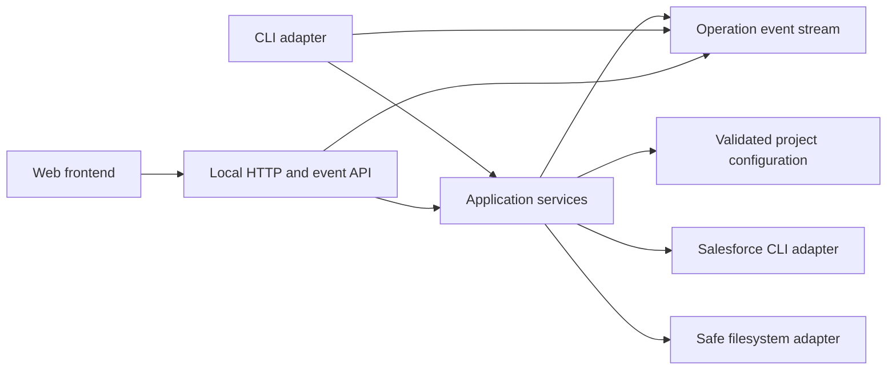

# Cross-platform Salesforce project tool

## Problem statement

Scratch-org creation and package maintenance are currently split across Bash, Batch, PowerShell and JavaScript. Behaviour differs by operating system, feedback is primarily unstructured terminal output, and the implementations are tightly coupled to this repository.

The tooling must become a standalone Node.js and TypeScript module that can be moved to its own repository and reused across Salesforce projects. The CLI remains the primary interface. A future web interface must use the same application services to inspect orgs, follow operation status and start commands without introducing a second execution model.

## Desired outcome

Developers can install one cross-platform tool and use it consistently on macOS, Linux and Windows. Commands provide detailed, actionable progress in an interactive terminal and stable machine-readable output for automation. The same typed operations and status events can later be exposed through a local web API and frontend.

## Guiding decisions

- CLI is the first-class product surface and defines the behavioural contract.
- Domain and application layers do not depend on a terminal, HTTP server, browser, Salesforce project or this repository.
- CLI and web adapters call the same application services and consume the same operation events.
- Repository-specific values live in validated project configuration.
- Destructive actions require explicit intent, path validation and dry-run support.
- Salesforce CLI remains the platform integration boundary; commands are executed without shell interpolation.
- The module targets Node.js 22 and uses TypeScript.

## Target module boundary

The initial module lives under `tools/salesforce-project-cli/` with its own `package.json`, TypeScript configuration, tests and build output. It must not import files outside that directory. The host repository integrates through npm scripts and a project configuration file.

A later extraction should require moving the module directory, publishing or packing it, and updating the host dependency. Product source, tests and repository-specific configuration must remain in the host repository.

## Conceptual architecture



## Proposed module structure

```text
tools/salesforce-project-cli/
├── package.json
├── tsconfig.json
├── src/
│   ├── cli/
│   ├── application/
│   ├── domain/
│   ├── infrastructure/
│   ├── server/
│   └── index.ts
├── web/
│   ├── src/
│   └── package.json
└── test/
    ├── fixtures/
    ├── unit/
    ├── integration/
    └── contract/
```

The `server` and `web` directories are delivered after CLI parity. The core package must remain usable without installing frontend dependencies.

## CLI contract

```text
sf-project org create
sf-project org delete
sf-project org list
sf-project org status [alias]
sf-project org info <alias>
sf-project packages install
sf-project packages update
sf-project packages plan
sf-project dependencies clear
sf-project dependencies refresh
sf-project project deploy
sf-project project configure
sf-project doctor
sf-project web start
```

Common options:

- `--project-dir <path>` selects the Salesforce project root.
- `--target-org <alias>` selects an org without changing repository configuration.
- `--dry-run` produces the complete operation plan without mutation.
- `--json` emits the stable machine-readable event and result contract.
- `--no-color` disables terminal styling.
- `--verbose` includes sanitized Salesforce CLI command details and diagnostic context.
- `--yes` confirms eligible non-production destructive actions in non-interactive environments.

## CLI feedback contract

Every operation emits typed events with operation ID, timestamp, step ID and optional parent step. Supported event kinds are `operation-started`, `step-started`, `progress`, `retrying`, `warning`, `step-completed`, `step-failed` and `operation-completed`.

Interactive output must show:

- operation and current step;
- completed and remaining steps;
- package or org currently processed;
- elapsed duration;
- retry count and reason;
- sanitized command details in verbose mode;
- warnings without hiding successful work;
- failure cause, failed step and suggested next action;
- final summary of created, installed, updated, skipped, failed and restored resources.

JSON output must be newline-delimited events followed by one final result event. Standard output contains JSON only; diagnostics go to standard error. Secrets, tokens, usernames classified as sensitive, installation keys and auth URLs must never be emitted.

Exit codes are stable: `0` success, `1` operation failure, `2` invalid input or configuration, `3` missing prerequisite, `4` authentication or authorization failure, and `5` partial completion requiring attention.

## Project configuration

The tool reads package definitions from `sfdx-project.json` and optional host-specific behaviour from `sf-project.config.json`.

```json
{
    "schemaVersion": 1,
    "defaultOrgAlias": "crm-arbeidsforhold",
    "scratchDefinition": "config/project-scratch-def.json",
    "scratchDurationDays": 14,
    "permissionSets": [],
    "dummyDataPlan": null,
    "communityName": null,
    "postSteps": ["deploy"],
    "packageInstallKeyEnvironmentVariable": "PACKAGE_INSTALL_KEY",
    "dependencySourcePolicy": {
        "preserveRootFiles": ["README.md"]
    }
}
```

Configuration is schema-versioned, validated before mutation and resolved into an immutable effective configuration. Command-line options override project configuration; project configuration overrides portable defaults. Environment variables are reserved for secrets and automation overrides.

## Org information model

The application layer exposes a normalized `OrgSummary` and detailed `OrgInfo` independently of CLI or web presentation.

Required information includes alias, username when permitted, org ID, org type, connection status, authentication status, instance URL classification, expiration date, remaining lifetime, default-org flags, source tracking support and last refresh time.

Supported classifications include scratch org, sandbox, development org, Dev Hub, production and unknown. The first release may read information through `sf org list --json`, `sf org display --json`, `sf config get --json` and package commands. It must not guess values that Salesforce CLI does not return.

## Web boundary

The web capability is a later adapter over the application layer. `sf-project web start` starts a loopback-only local server on a configurable port and opens no external network listener by default.

The initial frontend provides:

- overview of known scratch, development, sandbox and Dev Hub orgs;
- connection, authentication and expiration status;
- package installation status for a selected org;
- active and recent operation status with live event updates;
- detailed operation logs with secret redaction;
- forms to start the same commands exposed by the CLI;
- explicit confirmation for destructive actions;
- cancellation only for operations that declare cancellation support.

The API exposes typed query endpoints for org and operation information, command endpoints for approved operations, and Server-Sent Events or WebSocket events for live status. Transport DTOs are generated or validated from shared schemas, but HTTP types do not enter the application layer.

The frontend is an operational tool, not a marketing surface. It must support keyboard use, accessible names, clear status text, non-colour error indicators and responsive desktop and tablet layouts. A host-specific design-system adapter may use Aksel without coupling the reusable core package to Aksel.

## Security and safety

- The local server binds to `127.0.0.1` by default and rejects non-loopback host configuration unless explicitly enabled.
- Mutating HTTP requests require an ephemeral session token and same-origin protection.
- The browser never receives Salesforce access tokens, installation keys or raw auth files.
- Commands are allowlisted and arguments are schema-validated.
- Child processes are started without shell interpolation.
- Dependency cleanup resolves real paths, rejects paths outside the project root and handles symlinks safely.
- `.forceignore` changes use a lock, unique backup and `finally` restoration.
- Production and unknown orgs are read-only unless a future policy explicitly enables mutation.
- Logs and persisted operation history use centralized redaction and bounded retention.

## Functional requirements

- **REQ-001:** The tool runs on Node.js 22 on macOS, Linux and Windows.
- **REQ-002:** The module can be extracted without importing host-repository source.
- **REQ-003:** Repository-specific behaviour is supplied through validated configuration.
- **REQ-010:** The CLI is the authoritative command and behaviour contract.
- **REQ-011:** CLI commands cover org lifecycle, dependency sources, packages, deploy, project configuration and diagnostics.
- **REQ-012:** Every operation provides structured step, progress, retry, warning, failure and summary feedback.
- **REQ-013:** Every mutating operation supports a non-mutating dry run.
- **REQ-014:** CLI automation receives stable newline-delimited JSON events and documented exit codes.
- **REQ-015:** Sensitive values are redacted from all terminal, JSON, web and persisted output.
- **REQ-020:** Existing scratch-org Bash behaviour has characterized parity tests before replacement.
- **REQ-021:** Dependency cleanup preserves configured root files and cannot escape the project root.
- **REQ-022:** Dependency refresh restores `.forceignore` after success, failure or cancellation.
- **REQ-023:** Package resolution, install, update, skip and retry outcomes are deterministic and visible.
- **REQ-024:** Pool fetch and scratch creation fallback remain independently configurable.
- **REQ-030:** Org queries normalize scratch, development, sandbox, Dev Hub, production and unknown org information.
- **REQ-031:** Missing or unavailable org information is represented as unknown, never guessed.
- **REQ-032:** Production and unknown orgs are read-only by default.
- **REQ-040:** CLI and web adapters invoke the same application services.
- **REQ-041:** CLI and web clients consume the same typed operation-event contract.
- **REQ-042:** The local web server is loopback-only and protects mutating requests.
- **REQ-043:** The frontend shows org status, package status, operations and actionable failures.
- **REQ-044:** The frontend can start approved CLI-equivalent commands with explicit destructive confirmation.
- **REQ-050:** Unit, integration and contract tests run without Salesforce authentication.
- **REQ-051:** CI validates Node 22 on Ubuntu, macOS and Windows.
- **REQ-052:** Authenticated Salesforce end-to-end tests are optional and clearly reported as org-dependent.
- **REQ-060:** Existing scripts remain available through compatibility wrappers until parity is accepted.
- **REQ-061:** A packed module installs and runs in an independent Salesforce fixture repository.

## Delivery slices

1. Characterize current behaviour and record the module-boundary decision.
2. Scaffold the standalone TypeScript package and cross-platform CI.
3. Implement configuration, command execution, operation events and CLI presentation.
4. Implement safe dependency-source clear and refresh.
5. Implement package plan, install and update.
6. Implement scratch-org lifecycle, pool support and post-configuration steps.
7. Implement org inventory, status and detailed information queries.
8. Complete CLI feedback, JSON output, diagnostics and compatibility wrappers.
9. Implement the loopback API and live operation event transport.
10. Implement the operational web frontend.
11. Validate security, platform parity, packaging and extraction.

## Verification strategy

- Pure unit tests cover configuration, version comparison, command planning, redaction, event reduction and exit-code mapping.
- Filesystem integration tests use temporary directories for cleanup, traversal, symlink, lock and restoration behaviour.
- A fake `sf` executable in `PATH` drives deterministic process integration tests on all operating systems.
- Contract tests compare TypeScript dry-run plans with the current Bash implementation while it remains authoritative.
- API tests verify allowlisting, validation, loopback binding, same-origin protection and event streaming.
- Frontend tests cover status rendering, command confirmation, live progress, failures, keyboard navigation and accessibility.
- Package smoke tests install the npm tarball in a separate fixture project.
- Authenticated org tests are opt-in and never reported as passed unless Salesforce CLI completed successfully.

## Completion criteria

- All requirements have passing automated evidence or an explicitly approved org-dependent verification record.
- CLI parity is accepted before the Bash, Batch and PowerShell implementations become wrappers or are removed.
- The web interface cannot execute behaviour unavailable through the application layer and CLI contract.
- The CI matrix passes on Ubuntu, macOS and Windows with Node.js 22.
- The npm tarball works in an independent Salesforce fixture repository.
- Documentation explains installation, configuration, CLI output, security boundaries, web startup and extraction.

## Implementation status

The module is implemented under `tools/salesforce-project-cli/` with CLI, shared application services, loopback API and operational web frontend. Local verification covers typechecking, unit and contract tests, component tests, desktop/mobile browser tests, production build, npm tarball installation, production dependency audit and security review.

Two external gates remain before release:

- the module-local Node.js 22 matrix must run on Ubuntu, macOS and Windows after extraction or explicit activation in the host repository;
- authenticated Salesforce validation must run against an explicitly selected non-production org before claiming org lifecycle, package installation or deployment compatibility.

Existing Bash, Batch and PowerShell tools remain unchanged until parity is accepted. The migration matrix is maintained in `tools/salesforce-project-cli/docs/legacy-behavior-matrix.md`.

## Out of scope

- Hosting the web server as a shared multi-user service.
- Storing Salesforce credentials or replacing Salesforce CLI authentication.
- Enabling production-org mutation.
- Replacing Salesforce CLI package, deploy or org APIs.
- Requiring the web frontend to use the CLI process as an intermediary.
- Moving the module to a separate repository in the first implementation slice.

## Issue mapping

| Order | GitHub issue | Delivery slice                                               | Requirements                                      |
| ----- | ------------ | ------------------------------------------------------------ | ------------------------------------------------- |
| 1     | #1033        | Characterize scripts and decide module boundary              | REQ-020                                           |
| 2     | #1034        | Scaffold extractable TypeScript package and configuration    | REQ-001, REQ-002, REQ-003, REQ-051                |
| 3     | #1027        | Implement command runner and operation event model           | REQ-012, REQ-014, REQ-015, REQ-040, REQ-041       |
| 4     | #1023        | Implement safe dependency source clear and refresh           | REQ-013, REQ-021, REQ-022                         |
| 5     | #1024        | Implement package plan, install and update workflows         | REQ-011, REQ-013, REQ-015, REQ-023                |
| 6     | #1028        | Implement scratch-org lifecycle, pool and project setup      | REQ-011, REQ-013, REQ-015, REQ-024                |
| 7     | #1029        | Implement normalized org inventory, status and information   | REQ-030, REQ-031, REQ-032                         |
| 8     | #1026        | Deliver CLI feedback, diagnostics and compatibility wrappers | REQ-010, REQ-011, REQ-012, REQ-014, REQ-015, REQ-060 |
| 9     | #1030        | Expose loopback API and live operation events                | REQ-040, REQ-041, REQ-042                         |
| 10    | #1022        | Build operational web frontend for orgs and commands         | REQ-043, REQ-044                                  |
| 11    | #1032        | Validate security, packaging and repository extraction       | REQ-001, REQ-002, REQ-015, REQ-050, REQ-051, REQ-052, REQ-061 |

Epic #1021 is the completion and sequencing authority. Every implementation pull request must reference its issue and record focused validation evidence there.
