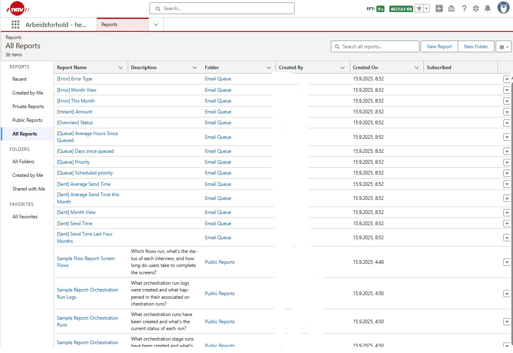

# Arbeidsforhold system documentation

This package contains Salesforce apps that support the work NAV does around the AA register. The solution was developed by Team Arbeidsforhold and includes, among other things, Experience Cloud and the dialogue solution from NKS, support, case management, applications and agreements.

## Access / Users type
There are four types of arbeidsforhold users in NAV as per now. 
- Case handler (internal user)
- Support (internal user)
- Community user
- Dialog

And depending on the type of user, access to arbeidsforhold app is provided.

### Casehandler Users:

Casehandler users are basically assigned permissions defined in permission set "AAREG Arbeidsforhold Saksbehandling", and are assigned to app "Arbeidsforhold"

When the casehandler user logs into Arbeidsforhold app, he is  basically shown five tabs:

- #### Arbeidsforhold Home
<figure>
    
    <figcaption>This tab is basically the entry page,  this page displays application statistics, list of applications case handler is working on, tasks and events scheduled for the day. It also lets user to create a new application, change owner for the application, etc..</figcaption>
</figure>
    Home page is divided into following sections:  
    *AA-registret Dashboard* : Dashboard shows seven types of reports and graphs
        <ul>
            <li>***Antall Søknader fordelt pr år***: *Aa-reg Application Status* -displays all applicaitons, grouped yearly, where application recordType is "AA-register access" and status is not Draft, and shows them as a bar-chart</li>
            <li>***Søknad - statistikk pr status***: *Aa-reg Application Status* - displays all applicaitons, grouped by status, where application recordType is AA-register access" and status is not Draft. Shows fields ApplicationSubmittedDate, CasehandlerStatus, Account and Application number as a lightning table</li>
            <li>***Aktive avtaler med kontaktperson***:  *AA-reg Agreement with Related Contacts* -gets all active Agreements with their related contacts. Shows AccountName, AgreementNumber, AccessTypes, RelatedContactName, AgreementNotifications and ErrorMessageNotifications"</li>
            <li>***Statistikk på søknad***: *AAREG Application statistics* -gets all applicaitons. Shows ApplicationCreatedDate,  Application number, TimeToSubmitted and TimeToDecision</li>
            <li>***Antall nye søknader - Siste 2 uker*** : *AA-reg Last two weeks* - Total number of applicaitons in the last two weeks</li>
            <li>***Antall nye søknader - I sin 3 uke ***:  *AA-reg third week* -  </li>
            <li>***- Antall nye søknader - 4 uker og eldre ***: *AA-reg new fourth and older* - </li>
        </ul>
    *Aa-reg Søknader Mine* : Displays all the active applications belonging to user.
    *Today's Tasks* : Displays tasks related to user defined for today
    *Today's Events* : Displays events related to user defined for today
   

- #### Arbeidsforhold Application
<figure>
    
    <figcaption>This tab lets the user see a list of all applications in the system. It also lets user to create a new application, change owner for the application etc.</figcaption>
</figure>   

- #### Arbeidsforhold Agreements
<figure>
    
    <figcaption>This tab lets the user see a list of all agreements in the system. It also lets user to create a new agreement, change owner for the agreement etc.</figcaption>
</figure>   

- #### Arbeidsforhold reports
<figure>
    
    <figcaption>This tab displays all the available reports and lets the user generate different reports</figcaption>
</figure>   

- #### Arbeidsforhold dashboards
<figure>
    
    <figcaption>This tab displays all the available dashbaords and lets the user see statistics defined in the reports related to them</figcaption>
</figure>   

### Support Users:

Support users are basically assigned permissions defined in permission set "AAREG Arbeidsforhold Support", and are assigned to app "Arbeidsforhold Henvendelse"

When the Support user logs into Arbeidsforhold Henvendelse app, he is  basically shown one Home tab, but still has the possibility to navigate to five other screens (Inquiries, Accounts, Contacts, Reports, Dashboard) using a drop down menu.

- #### Arbeidsforhold Henvendelse Home
<figure>
    
    <figcaption>This tab is basically the entry page,  this page displays support cases statistics, list of support cases case handler is working on. It also lets user to create a new support case.</figcaption>
</figure>   

- #### Arbeidsforhold Henvendelse Accounts
<figure>
    
    <figcaption>This tab lets the user see a list of all accounts in the system. It also lets user to create a new account, could be of type Business / private/ Employer.</figcaption>
</figure>   

- #### Arbeidsforhold Henvendelse Contacts
<figure>
    
    <figcaption>This tab lets the user see a list of all contacts in the system. It also lets user to create a new contact connected to an account. An account can also be created as a part of this process</figcaption>
</figure>   

- #### Arbeidsforhold Henvendelse Reports
<figure>
    
    <figcaption>This tab displays all the available reports and lets the user generate different reports.</figcaption>
</figure>   

- #### Arbeidsforhold Henvendelse Dashboards
<figure>
    
    <figcaption>This tab displays all the available dashbaords and lets the user see statistics defined in the reports related to them.</figcaption>
</figure>   

### Community user (experience cloud):

Support users are basically assigned permissions defined in permission set "AAREG Community Permission", and are assigned to app "Min Side - RbukerStætte og søknad om tilgang til AA-registeret".

When the community user logs into this app, he is basically shown one Home tab but still has the possibility to navigate to few other screens to look exisiting agreements, applications, inquiries and to let him create these as well.

- #### ExperienceCloud Home
<figure>
    
    <figcaption>this tab lets the user to create a new application for the organizations where he is access to. In addition to this, there are sections to choose a different organization, display user owned applications, agreements, inquiries and messages, etc.</figcaption>
</figure>   

- #### ExperienceCloud : Other pages
<figure>
    
    <figcaption>These pages which exists in the drop down menu are basically used as part of the options given on the home page.</figcaption>
</figure>   

