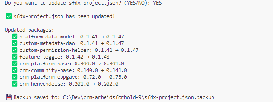
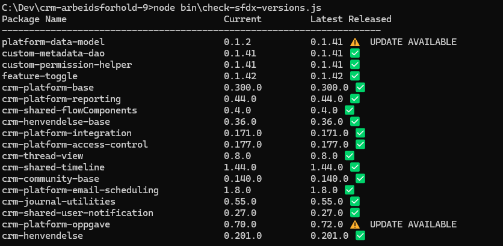

# 1.How to check versions in sfdx-project.json file against updated dependent packages

Windows system
- Open CMD(Command Prompt) or use terminal in visual studio code
- Go to your folder where you have your project
- Run node bin\check-sfdx-versions.js
- Update sfdx-project.json automatic by pressing YES
- Backup is saved to sfdx-project.json.backup



### Useful CMD(Command Prompt) commands

| Command | Description | Example |
|---|---|---|
| `cd..` | Go **up** one folder level | If you are in `C:\Dev\crm-arbeidsforhold-9\bin`, you will go to `C:\Dev\crm-arbeidsforhold-9` |
| `cd foldername` | Go **into** a subfolder | `cd Dev` will take you from `C:\` to `C:\Dev` |
| `cd /d C:\path` | Go to a **specific folder** on any drive | `cd /d C:\Dev\crm-arbeidsforhold-9` |
| `dir` | **List** all files and folders in current directory | Shows files like `sfdx-project.json`, `package.json`, etc. |

```cmd
C:\Users\YourName> cd /d C:\Dev\crm-arbeidsforhold-9
C:\Dev\crm-arbeidsforhold-9> node bin\check-sfdx-versions.js
```

It will list package name, current version, latest release.


# 2.How to create a new Scratch Org using newScratchOrg.bat

### Prerequisites
- Salesforce CLI (`sf`) installed
- PowerShell available (Windows 10+ has it by default)
- Authenticated to your **Dev Hub** (`sf org login web --set-default-dev-hub`)
- Project cloned locally

### Usage

#### Option 1: Using CMD (Command Prompt)
1. Open **CMD** (press `Win + R`, type `cmd`, press Enter)
2. Navigate to the project root folder
3. Run the batch file with your installation key

```cmd
cd /d C:\Dev\crm-arbeidsforhold-9
.\bin\newScratchOrg.bat <installation-key>
```

#### Option 2: Using Terminal in Visual Studio Code
1. Open the project in Visual Studio Code
2. Open the terminal (`Ctrl + ´` or go to **Terminal** → **New Terminal**)
3. Make sure you are in the **project root folder** (check the path in the terminal)
4. Run the batch file with your installation key

```cmd
.\bin\newScratchOrg.bat <installation-key>
```

> **Tip:** If the terminal opens in a subfolder, use `cd..` to go up one level until you see `C:\Dev\crm-arbeidsforhold-9`

**Example:**
```cmd
.\bin\newScratchOrg.bat MySecretKey123
```

### What it does (step by step)

| Step | Action | Description |
|---|---|---|
| 1/6 | **Delete scratch org** | Deletes any existing scratch org with alias `crm-arbeidsforhold` |
| 2/6 | **Create scratch org** | Creates a new scratch org (30 day duration) and opens it in browser |
| 3/6 | **Install packages** | Resolves and installs all dependency packages from `sfdx-project.json` |
| 4/6 | **Deploy project** | Deploys the project source code to the scratch org |
| 5/6 | **Assign permission sets** | Assigns required permission sets to the default user |
| 6/6 | **Insert test data** | Imports test data from `dummy-data/Plan.json` |

### How package installation works (Step 3)

The batch file uses `resolve_packages.ps1` (PowerShell) to automatically resolve packages:

1. **Reads** `sfdx-project.json` and finds all dependencies
2. **Looks up** each package name in `packageAliases` to get the `0Ho` package ID
3. **Calls** `sf package version list` for each package to find the latest released `04t` version
4. **Checks** `IsPasswordProtected` to determine if an installation key is needed
5. **Returns** results to the batch file as `PackageName|04tVersionId|KEY/NOKEY`

The batch file then installs each package in dependency order, skipping the installation key for packages that don't require one.

### Configuration

These variables can be changed at the top of `newScratchOrg.bat`:

| Variable | Default | Description |
|---|---|---|
| `ORG_ALIAS` | `crm-arbeidsforhold` | Alias for the scratch org |
| `ORG_DURATION` | `30` | Number of days before the scratch org expires |
| `SCRATCH_DEF` | `config\project-scratch-def.json` | Path to scratch org definition |
| `SFDX_PROJECT` | `sfdx-project.json` | Path to SFDX project file |
| `TEST_DATA_PLAN` | `dummy-data\Plan.json` | Path to test data import plan |

### Files in bin folder

| File | Description |
|---|---|
| `newScratchOrg.bat` | Main script to create and configure a scratch org |
| `resolve_packages.ps1` | PowerShell helper that resolves latest package versions |
| `check-sfdx-versions.js` | Node.js script to compare current vs latest package versions |

# 3.How to fetch a Scratch Org from Scratch Org Pool

A scratch org pool contains pre-built scratch orgs with packages already installed, which is **much faster** than creating one from scratch.

### Prerequisites
- Salesforce CLI (`sf`) installed
- **SFDX CLI** with the `sfpowerscripts` plugin installed
- Authenticated to your **Dev Hub** (`sf org login web --set-default-dev-hub`)
- Access to a scratch org pool configured in the Dev Hub

### Install sfpowerscripts plugin

```cmd
sf plugins install @flxbl-io/sfp
```

Verify the plugin is installed:

```cmd
sf plugins
```

### Usage

#### Option 1: Using CMD (Command Prompt)
1. Open **CMD** (press `Win + R`, type `cmd`, press Enter)
2. Navigate to the project root folder
3. Fetch a scratch org from the pool

```cmd
cd /d C:\Dev\crm-arbeidsforhold-9
sf pool:fetch --tag crm-arbeidsforhold --targetdevhubusername <devhub-alias> --setdefaultusername --alias crm-arbeidsforhold
```

#### Option 2: Using Terminal in Visual Studio Code
1. Open the project in Visual Studio Code
2. Open the terminal (`Ctrl + ´` or go to **Terminal** → **New Terminal**)
3. Make sure you are in the **project root folder**
4. Fetch a scratch org from the pool

```cmd
sf pool:fetch --tag crm-arbeidsforhold --targetdevhubusername <devhub-alias> --setdefaultusername --alias crm-arbeidsforhold
```

### Command parameters

| Parameter | Description | Example |
|---|---|---|
| `--tag` | The tag/name of the scratch org pool | `crm-arbeidsforhold` |
| `--targetdevhubusername` | Alias or username of the Dev Hub | `myDevHub` |
| `--setdefaultusername` | Sets the fetched org as default for the project | |
| `--alias` | Alias to give the fetched scratch org | `crm-arbeidsforhold` |

### After fetching from pool

Once you have fetched a scratch org, you may still need to:

1. **Deploy your latest source** (if pool org doesn't have your latest changes)
2. **Assign permission sets** (if not pre-assigned in the pool)

```cmd
sf project deploy start --target-org crm-arbeidsforhold
sf org assign permset --name AAREG_Arbeidsforhold_Saksbehandling --target-org crm-arbeidsforhold
```

### Pool vs newScratchOrg.bat — when to use what

| Scenario | Use |
|---|---|
| Pool is available and has scratch orgs | `sf pool:fetch` — **fastest** (seconds) |
| Pool is empty or unavailable | `.\bin\newScratchOrg.bat` — creates from scratch (~15-30 min) |
| Need a clean org with latest packages | `.\bin\newScratchOrg.bat` — guaranteed fresh |
| Quick development/testing | `sf pool:fetch` — pre-configured and ready |

### Useful pool commands

| Command | Description |
|---|---|
| `sf pool:list --tag crm-arbeidsforhold --targetdevhubusername <devhub>` | List available scratch orgs in the pool |
| `sf pool:fetch --tag crm-arbeidsforhold --targetdevhubusername <devhub>` | Fetch a scratch org from the pool |
| `sf org list` | List all orgs you have access to |
| `sf org open --target-org crm-arbeidsforhold` | Open the scratch org in browser |