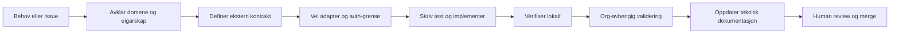

# Arbeidsflyt og dokumentasjon

Dette dokumentet beskriver korleis nye funksjonar og integrasjonar går frå behov til implementasjon, og korleis dokumentasjonen blir halden oppdatert.

## System for record

- **GitHub Issues** er systemet for arbeidsoppgåver, user stories, avklaringar og akseptansekriterium.
- **`.github/specs/`** inneheld korte, repo-eigde feature-spesifikasjonar når ei sak krev meir enn Issue-malteksten.
- **`docs/adr/`** inneheld arkitekturvedtak. Eitt ADR skal opprettast når eit val påverkar fleire modular, offentlege kontraktar, datakjelder eller integrasjonsgrenser.
- **`docs/architecture/`**, **`docs/domain/`**, **`docs/integrations/`** og **`docs/surfaces/`** inneheld stabil teknisk dokumentasjon.
- **Confluence** er fasit for prosess, funksjonell brukardokumentasjon og operative runbooks. Repoet skal lenkje til slik dokumentasjon eller halde ein merkt spegelkopi, ikkje lage ein konkurrerande fasit.

## Integrasjonsarbeidsflyt

### 1. Start med ei Issue

Skriv problemet som ein observerbar brukar- eller systemeffekt. Ta med eigar, avgrensing, akseptansekriterium, personvern/auth-vurdering og kva som er utanfor scope.

### 2. Avklar grensa

Før kode skal teamet avklare:

- kva som eig data og domeneregel;
- kva ekstern kontrakt som skal støttast;
- kvar autentisering, mapping, retry og feilhandsaming høyrer heime;
- om endringa er grøn eller raud sone;
- om eit ADR eller ein feature-spec er nødvendig.

Integrasjonar skal omsetje mellom kontraktar. Dei skal ikkje flytte domenelogikk inn i klienten eller brukarflata.

### 3. Bygg i ei vertikal skive

Bruk red-green-refactor når miljøet støttar det:

1. Skriv ein fokustest for den observerbare åtferda.
2. Køyr testen og dokumenter raud status når det er mogleg.
3. Implementer minste løysing.
4. Køyr fokustesten på nytt.
5. Køyr relevant breiare lokal validering.
6. Køyr org-avhengige testar eller deployment preview når tilgang og miljø er tilgjengeleg.

### 4. Dokumenter kontrakten

Teknisk integrasjonsdokumentasjon skal minst beskrive:

- system og eigarskap;
- request/response eller event-kontrakt;
- autentisering og Named Credentials/konfigurasjon utan secrets;
- mapping og validering;
- retry, timeout, idempotens og feilhandsaming;
- logging, correlation ID og personvern;
- teststrategi og kjende avgrensingar.

## User story-prosess

User stories blir oppretta gjennom GitHub Issue-malen [User story](../.github/ISSUE_TEMPLATE/user-story.yml).

Ei story er klar for implementasjon når ho har:

- éin tydeleg brukar eller systemaktør;
- eit konkret behov og ein forventa effekt;
- testbare akseptansekriterium;
- avklart scope og eksplisitte ut-av-scope-punkt;
- relevante avhengigheiter og risikoar;
- peikar til feature-spec eller ADR når slike finst.

Ved ferdigstilling skal Issue-en lenkje til PR-en og oppsummere kva som faktisk blei verifisert. Ei story skal ikkje lukkast berre fordi koden er skriven; akseptansekriterium og relevante valideringar må vere dekte.

## Oppdateringsmekanisme

Dokumentasjon blir oppdatert i same PR som endringa når endringa påverkar ein dokumentert kontrakt eller arbeidsflyt.

- Endra API-, event-, auth- eller mappingkontrakt: oppdater integrasjonsdokumentet og relevante testar.
- Nytt tverrgåande arkitekturval: opprett eller oppdater ADR.
- Ny eller endra funksjon: oppdater feature-spec og Issue-lenkjer.
- Endra operativ prosess: oppdater Confluence-runbook og lenk frå Issue/PR; ikkje rediger `speilkopi: ja` utan å oppdatere kjelda.
- Vedlikehaldsendringar utan dokumentert åtferdsendring treng normalt ikkje nytt dokument, men PR-en skal forklare kvifor.

PR-review skal kontrollere at kode, testar, Issue, spec, ADR og dokumentasjon peikar på same observerbare kontrakt. Når dokumentasjon ikkje kan oppdaterast i same PR, skal det opprettast ei lenka oppfølgings-Issue før merge.

## Validering

Minstekrav for repo-eigd dokumentasjon:

- relative lenkjer peikar til eksisterande filer;
- Mermaid-diagram kan lesast som tekst og har ingen secrets;
- Markdown-formattering passerer Prettier for dei endra filene;
- status er tydeleg skild mellom vedteke, foreslått, spegla og uverifisert.
