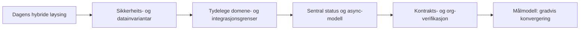
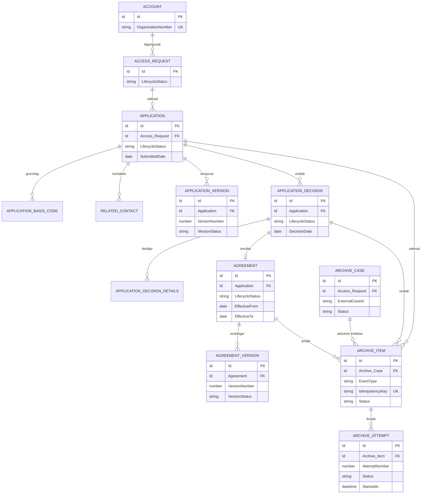
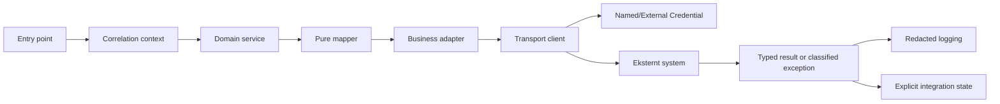

# Forbetringsforslag og målmodell

Dette dokumentet peikar ut forbetringar i `crm-arbeidsforhold` basert på dagens kode, metadata, package-struktur og eksisterande arkitekturdokumentasjon.

Det er eit **forslagsdokument**, ikkje ein godkjend migreringsplan. Ingen av forslaga skal implementerast berre fordi dei står her. Endringar som påverkar deling, persondata, offentlege API-ar, metadata, pakkekontraktar eller integrasjonar må først få ei eiga Issue, testplan og menneskeleg review.

## Korleis lese dokumentet

- **Verifisert:** observert direkte i repositoryet.
- **Vurdering:** teknisk konsekvens av observert struktur.
- **Forslag:** anbefalt retning, ikkje vedteken arkitektur.
- **Org-avhengig:** må stadfestast med metadata, installed packages, Flow-køyring eller test i Salesforce-org.
- **Prioritet P0:** sikkerheit, dataintegritet eller risiko for feil produksjonsåtferd.
- **Prioritet P1:** stor forbetring i drift, testbarheit eller vedlikehald.
- **Prioritet P2:** forenkling, standardisering eller langsiktig modernisering.

## Samla vurdering

Løysinga har eit sterkt funksjonelt fundament og mange etablerte plattformkomponentar. Samtidig lever tre arkitekturstilar parallelt:

1. **Eldre Salesforce-stil:** controllerar, Flow, triggerar og `@future` med ansvar spreidd over fleire metadataområde.
2. **Plattformstil:** dependency-pakkar med felles logging, tilgang, integrasjon, oppgåver og community-kapabilitetar.
3. **Nyare integrasjonsstil:** P360 med domain context, mapper, adapter, client, constructor injection, idempotens og kontrollert retry.

Den viktigaste overordna anbefalinga er derfor ikkje ein total omskriving. Det tryggaste målbiletet er ei **gradvis konvergering** mot tydelegare grenser, sterkare datainvariantar og meir eksplisitt async-/integrasjonsstatus, samtidig som eksisterande offentlege Salesforce-kontraktar blir bevarte.

## 1. Mål for datamodellen

### 1.1 Prinsipp

Datamodellen bør gjere følgjande tydeleg:

- kva som er autoritativt domeneobjekt;
- kva som er historikk og kva som er aktuell status;
- kva som er teknisk integrasjonsstatus;
- kva som kan ha fleire versjonar;
- kva som må vere unikt;
- kven som eig relasjonen;
- kva som er slettbart og kva som må bevarast av arkiv- eller revisjonsomsyn.

I dag er noko av dette uttrykt i relasjonar, noko i Flow, noko i formula-/rollup-felt og noko i tekniske P360-jobbar. Det fungerer, men gjer konsekvensane av ein statusendring vanskelege å sjå frå eitt objekt.

### 1.2 Foreslått konseptuell modell

Diagrammet er eit målkonsept, ikkje eit forslag om å opprette alle objekta no.

### 1.3 Konkrete datamodellforbetringar

#### A. Skill domene-status frå teknisk status

**Observasjon:** `Application__c`, `Application_Decision__c` og `Agreement__c` har statusar som delvis blir drivne av picklist, formula, rollup, Flow og controllerlogikk. P360 har ein eigen jobbstatus på `P360_Archive_Job__c`.

**Forslag:** Behald domene-status på domeneobjekta, men bruk eigne tekniske statusfelt/objekt for integrasjon, filprosessering og async-operasjonar. Ikkje bruk P360-referansefelt eller `Status__c` som retry-status.

**Gevinst:** Mindre risiko for at teknisk feil endrar forretningsstatus, og enklare rapportering på "søknaden er godkjend" versus "vedtaksdokumentet er ikkje arkivert".

**Salesforce Best Practice:** Ein status bør ha éin tydeleg eigar og éin definert livssyklus. Teknisk prosessstatus bør ikkje blandast med forretningsstatus.

**Prioritet:** P0/P1.

#### B. Vurder eksplisitt historikk for søknad og avtale

**Observasjon:** Avtaleendringar og revisjonsoppgåver finst, men livsløpet er spreidd mellom `Agreement__c`, Tasks, Flow og brukarflate.

**Forslag:** Før ein opprettar nye objekt, dokumenter om Salesforce Field History, `Agreement__c`-versjonar eller eit eige revisjonsobjekt skal vere autoritativ historikk. Vel éin modell per forretningsbehov:

- Field History for enkel feltendring og revisjonsspor.
- Eige versjonsobjekt for juridisk eller funksjonell avtaleversjon.
- Task/Activity for arbeidsaktivitet, ikkje som kjelde for avtaleinnhald.

**Gevinst:** Unngår at historikk blir rekonstruert frå oppgåver, Flow og feltlogg i etterkant.

**Salesforce Best Practice:** Bruk standard historikkfunksjonar der dei dekkjer behovet, og eit eige objekt berre når historikken har eigen forretningsidentitet, rapportering eller retention-regel.

**Prioritet:** P1.

#### C. Gjer organisasjonsidentitet eksplisitt og konsistent

**Observasjon:** `Account` er sentral, medan organisasjonsnummer og organisasjonsstruktur blir brukt på tvers av Application, Agreement og Experience Cloud. Personkonto-/kontaktmodell er framleis delvis føreslått i ADR-0002/0003.

**Forslag:** Definer `Account` som autoritativ organisasjon, med ein tydeleg unikhetsstrategi for organisasjonsnummer. Dokumenter når Contact, AccountContactRelation og `User.LastUsedOrganization__c` kan brukast, og kva som skjer ved fleire organisasjonar, fusjonar eller endra organisasjonsnummer.

**Gevinst:** Mindre risiko for feil tilgang eller data kopla til feil verksemd.

**Salesforce Best Practice:** Unik ekstern identitet bør validerast på dataeigar-objektet, ikkje berre kopierast som tekstfelt på barn.

**Prioritet:** P0.

#### D. Standardiser integrasjonsreferansar

**Observasjon:** P360 har nye eigne referansefelt, medan `Agreement__c.Public_360_id__c` er merka legacy. Andre integrasjonar har eldre ID-felt og eigne mønster.

**Forslag:** Lag ein felles metadata- og dokumentasjonsstandard for eksterne ID-ar:

- systemprefiks i API-namn eller tydeleg eigarskap;
- feltlengd og format dokumentert;
- External ID/unique berre når semantikken faktisk er unik;
- ingen overskriving eller blanking utan autorisert integrasjonsflyt;
- ingen bruk av eksternt ID-felt som retry-status.

**Prioritet:** P1.

## 2. Domene- og automasjonsforbetringar

### 2.1 Vel tydelegare eigar for statusovergangar

**Observasjon:** Status og sideeffektar er fordelte mellom LWC, Apex, Flow, triggerar og metadata.

**Forslag:** For kvar viktig overgang, skriv ein liten overgangstabell:

| Overgang              | Autoritativ eigar   | Sideeffektar             | Feilstrategi                   |
| --------------------- | ------------------- | ------------------------ | ------------------------------ |
| Utkast → Ny           | Søknadsservice/Flow | frist, eigar, kvittering | transaksjonsfeil til brukar    |
| Ny → Under behandling | Saksbehandling/Flow | oppgåve, eigar, varsling | synleg arbeidskø               |
| Vedtak → Ferdig       | Vedtaksservice/Flow | avtale, PDF, varsling    | stopp eller manuell oppfølging |
| Avtale → Aktiv        | Avtaleflyt          | distribusjonstilgang     | async status og retry          |
| Klar for P360         | P360 guard          | jobboppretting           | avvis før frigiving            |

**Gevinst:** Lettare å oppdage dobbeltimplementering og uventa rekursjon.

**Salesforce Best Practice:** Éin automasjonsmotor bør eige ein overgang når fleire motorar elles kan skrive same felt.

**Prioritet:** P0/P1.

### 2.2 Reduser Flow-/trigger-/controller-krysskopling gradvis

**Observasjon:** Dette er ein funksjonell styrke i Salesforce, men gjer flyten vanskelegare å teste og feilsøke.

**Forslag:** Ikkje flytt alt til Apex. Bruk ei kontrollert regel:

- Flow for enkel deklarativ orkestrering og varsling.
- Apex service for bulk-safe domenereglar, komplekse valideringar og gjenbruk.
- Trigger-handler for inngang og guard, ikkje for lange arbeidsflytar.
- Queueable for callout og lengre arbeid.
- LWC for presentasjon og klientvalidering, ikkje sikkerheitsavgjerder.

**Gevinst:** Bevarer Salesforce-styrken utan at same forretningsregel blir kopiert i fire lag.

**Prioritet:** P1.

### 2.3 Lag eksplisitte transition-/command-tenester for raud sone

**Forslag:** For frigiving, vedtak, avtaleavslutting og tilgangsendring bør det finnast éin eksplisitt backend-operasjon per kritisk overgang, sjølv om Flow og LWC framleis er inngangar.

Operasjonen bør:

1. validere tilgang og føresetnader;
2. validere aktuell status og forventet overgang;
3. utføre DML i rett rekkjefølgje;
4. opprette async jobb dersom nødvendig;
5. skrive correlation-/auditkontekst;
6. returnere eit typa resultat.

**Prioritet:** P0 for tilgang, vedtak og arkivering; P1 for resten.

## 3. Salesforce Best Practices som bør styrkast

### 3.1 Bulk og transaksjonsgrenser

- Alle trigger-handlerar må vere bulk-safe og frie for SOQL/DML i loop.
- Flow som kan starte på mange postar må vurderast for bulk og governor limits.
- Async-jobbar bør ta batch-storleik som eksplisitt designparameter.
- DML bør samlast per objekt og transaksjonsgrense må dokumenterast.
- Re-entrant automation bør ha guard mot dobbel behandling.

**Verifikasjon:** Apex-test med fleire postar, Flow bulk-test og governor-limit-måling i org.

### 3.2 Sikkerheit som lagdelt kontroll

- `with sharing` som standard for ny Apex.
- USER_MODE/FLS-kontroll i alle nye lese-/skrivestiar.
- Sharing for radnivå, permission sets/custom permissions for kapabilitet, FLS for felt.
- Brukar-ID og record-ID frå klient skal aldri vere einaste tilgangskontroll.
- Experience Cloud-metodar må gjennomgåast særleg for IDOR og `without sharing`.
- Callout- og Named Credential-tilgang skal liggje i permission set, ikkje i skjulte kodeføresetnader.

**Prioritet:** P0.

### 3.3 Feilhandtering og observability

- Bruk felles `LoggerUtility`/integrasjonslogging, ikkje spreidd `System.debug`.
- Logg correlation ID, operasjon, status og teknisk feilkode.
- Rediger tokens, auth-header, personidentifikatorar og dokumentinnhald før logging.
- Returner brukarvennleg feil til LWC, men bevar teknisk årsak i logg.
- Unngå blanket catch som gjer ein mislykka prosess usynleg.
- Standardiser error code, retrybarheit og manuell oppfølging på tvers av callout-integrasjonar.

**Prioritet:** P0/P1.

### 3.4 Metadata og konfigurasjon

- Bruk Custom Metadata for deploybar, ikkje-sensitiv mapping.
- Bruk Named/External Credentials for secrets og endpoint-auth.
- Bruk Custom Permissions og Permission Sets for kapabilitetar.
- Unngå hardkoda ID-ar, URL-ar, profilnamn og kodeverk i Apex/LWC.
- Dokumenter kva som må setjast per org etter deploy.

**Prioritet:** P1.

## 4. Integrasjonar og async

### 4.1 Felles integrasjonskontrakt

P360 viser eit godt målbildet. Same minimumsmodell bør gradvis brukast på andre callout-integrasjonar:

**Forslag:** Ingen ny integrasjon bør introdusere direkte HTTP i LWC/controller, skjulte statiske tokenoppslag eller status berre i tekstfelt.

### 4.2 Standardiser jobb- og retry-modell

**Observasjon:** P360 har `P360_Archive_Job__c`, lease, idempotens og `Manual Review`; eldre distribusjonsflyt brukar enklare `@future`-mønster.

**Forslag:** Lag ein felles teknisk standard, ikkje nødvendigvis eitt felles objekt med ein gong:

- idempotensnøkkel;
- første køtid;
- forsøksteljar;
- lease eller eksklusjonsmekanisme;
- neste forsøk;
- retrybar/permanent feil;
- correlation ID;
- manuell oppfølging;
- endeleg teknisk resultat.

**Salesforce Best Practice:** Queueable er vanlegvis betre enn eldre `@future` når jobben treng struktur, chaining, status eller testbar input.

**Prioritet:** P1.

### 4.3 Unngå semantisk dobbeltstatus

Ein domene-post bør ikkje vere `Approved` medan integrasjonen har feila utan at det finst eit eksplisitt teknisk statusfelt eller jobb som forklarer skilnaden. Rapporter og UI bør vise begge dimensjonar:

- forretningsstatus;
- integrasjonsstatus.

## 5. Forbetring av datakvalitet og governance

### 5.1 Definer invariantar som metadata og testar

For kvar sentral relasjon bør det finnast eksplisitte invariantar:

- organisasjonsnummer er validert og unikt etter avtalt scope;
- `Application__c` må ha rett record type;
- vedtak må ha søknad;
- avtale må ha gyldig opphav og livsløp;
- vedtaksdetaljar må samsvare med basis-kodar ved oppretting;
- berre éin aktiv avtale per definert tilgangskontekst;
- arkiveringsjobb har éin unik idempotensnøkkel;
- P360-referansar kan ikkje blankast av vanleg brukar.

Test både positive og negative invariantar med Apex-testar og metadata-/org-verifikasjon.

### 5.2 Skil aktiv data frå historikk og teknisk audit

Unngå at eitt felt prøver å vere:

- aktuell status;
- historikk;
- integrasjonskvittering;
- brukarens forklaring;
- teknisk feilmelding.

Bruk heller eigne felt eller barnobjekt med tydeleg retention og tilgang. Dette gjer rapportering og sletting/arkivering meir føreseieleg.

### 5.3 Filer bør ha eksplisitt livsløpsmodell

For kvar filtype bør teamet dokumentere:

- kven som kan laste opp, lese, slette og erstatte;
- kva objekt fila skal vere knytt til;
- maks storleik og støtta format;
- om fila er persondata eller arkivpliktig;
- når fila blir sendt til integrasjon;
- kva som skjer ved retry eller ny versjon;
- om fila kan slettast etter arkivering.

Salesforce Files bør ikkje brukast som ein udefinert transportbuffer utan slike reglar.

## 6. Observability og drift

### Forslag til standard dashboard-/rapportdimensjonar

- søknader per status og alder;
- søknader i `Additional Information Required` over frist;
- vedtak oppretta utan ferdig dokument;
- aktive avtalar utan synkronisert distribusjonstilgang;
- P360-jobbar per status, feiltype og forsøk;
- jobbar med utgått lease;
- integrasjonar med aukande retry-rate;
- filer som står utan arkiveringsresultat;
- Flow-/Apex-feil per funksjonsområde.

### Alerting

Varsle på:

- aukande `Manual Review`;
- mange `Failed` etter same feilkode;
- lease som går ut utan worker-resultat;
- manglande vedtak-/avtalefiler;
- callout-timeout og auth-feil;
- mismatch mellom domenestatus og teknisk integrasjonsstatus.

Dette støttar Well-Architected-dimensjonen **Trusted** gjennom betre deteksjon og recovery, ikkje berre logging etter feilen.

## 7. Forslag til prioritering

| Prioritet | Forbetring                                                                                  | Kvifor først                                                    |
| --------- | ------------------------------------------------------------------------------------------- | --------------------------------------------------------------- |
| P0        | Tilgangsreview av eldre `without sharing`, brukar-ID-parametrar og Experience Cloud-oppslag | Risiko for uautorisert data- eller radtilgang                   |
| P0        | Dokumenter og test statusovergangar for søknad, vedtak, avtale og arkivering                | Reduserer feil sideeffektar og uklare livsløp                   |
| P0        | Standardiser teknisk integrasjonsstatus og error/retry semantics                            | Hindrar at forretningsstatus skjuler teknisk feil               |
| P1        | Gjer queueable/jobmodell til standard for nye callout-flytar                                | Betre retry, observability og testbarheit enn spreidd `@future` |
| P1        | Etabler data-invariantar og negative testscenario                                           | Fangar feil relasjon, record type og status før produksjon      |
| P1        | Dokumenter fil-livsløp og arkiv-/retention-reglar                                           | Reduserer personvern-, lagrings- og duplikatrisiko              |
| P1        | Standardiser integrasjonslogging, correlation ID og redaksjonering                          | Gjer feilsøking mogleg utan å lekke data                        |
| P2        | Gradvis flytting frå historiske controller-/Flow-grenser til tydelege services              | Forbetrar vedlikehald utan stor risikofylt rewrite              |
| P2        | Samle repeterte domeneverdiar i Custom Metadata/Custom Labels                               | Reduserer hardkoding og gjer miljøtilpassing enklare            |
| P2        | Vurder framtidig splitting av package directories basert på eigarskap                       | Gjer package governance og deploy mindre kopla over tid         |

## 8. Foreslått leveranseplan

### Fase 1: Trusted

1. Tilgangsreview av dei viktigaste Experience Cloud-controllerane.
2. Status- og overgangsmatrise for søknad, vedtak, avtale og distribusjon.
3. Negative testar for IDOR, FLS, sharing, feil record type og ugyldige statusovergangar.
4. Standard error-/logging-/correlation-kontrakt.

### Fase 2: Easy

1. Isoler reint domene- og mappingansvar frå controllerar.
2. Reduser duplisering mellom Flow og Apex.
3. Gjør filer, vedtaksdetaljar og avtalehistorikk eksplisitt dokumentert.
4. Lag lokale testfabrikkar for komplette brukarjourneys.

### Fase 3: Adaptable

1. Standardiser async-jobbar for nye integrasjonar.
2. Kople P360 live transport først etter kontraktavklaring.
3. Vurder package-eigarskap og framtidig splitting.
4. Bygg driftspanel og alerting på teknisk status, ikkje berre domene-status.

## 9. Kva bør ikkje gjerast no?

- Ikkje totalomskriv heile `force-app` til ein ny foldermodell.
- Ikkje masseflytt eksisterande metadata utan migreringsplan og deploy-/referanseanalyse.
- Ikkje lag eit generelt superobjekt for alle integrasjonar før dei konkrete invariants er kjende.
- Ikkje flytt all Flow-logikk til Apex berre for å få same stil overalt.
- Ikkje bygg reell P360-transport før endpoint, auth, envelope, mapping og filstrategi er stadfesta.
- Ikkje endre dependency-pakkar som er read-only i dette repositoryet.
- Ikkje legg secrets, tokens eller miljøspesifikke URL-ar i metadata eller dokumentasjon.

## 10. Verifikasjon før implementering

Før eit forslag blir gjort til kode, bør Issue-en svare på:

- Kva observerbar feil eller kostnad skal forbetringa løyse?
- Kva eksisterande Salesforce-kontrakt må bevarast?
- Kva objekt, Flow, trigger, permission set og package blir påverka?
- Kva er Trusted-, Easy- og Adaptable-vurderinga?
- Kva er red-zone: tilgang, persondata, auth, callout eller metadata?
- Kva fokustest kan vise raud og grøn åtferd?
- Kva må verifiserast i `crm-arbeidsforhold`-orgen?
- Treng avgjerda ein ny eller oppdatert ADR?
- Korleis blir rollback, retry, migrering og historikk handtert?

## Konklusjon

Den beste vidare retninga er å styrke invariantar, statusgrenser, sikkerheit og async-observability før ein gjer større strukturelle flytt. P360 gir eit godt eksempel på målarkitektur for nye integrasjonar, medan eldre søknads-, avtale- og Flow-flytar bør moderniserast gradvis rundt verifiserte forretningskontraktar.

Dette gir den beste balansen mellom Salesforce Best Practices og Well-Architected:

- **Trusted:** minst privilegium, eksplisitte invariantar, sporbarheit og recovery.
- **Easy:** tydelege eigarar, mindre krysskopling og betre testbarheit.
- **Adaptable:** standardiserte integrasjonsgrenser, jobbmodell og package-eigarskap.
