# Heile løysinga: arkitektur og flyt

Dette dokumentet gir ei samla, stegvis forklaring av korleis `crm-arbeidsforhold` er bygd og korleis dei viktigaste delane heng saman.

Målgruppa er utviklarar og andre tekniske personar som treng eit oversiktskart før dei går inn i ein konkret controller, Flow, LWC, integrasjon eller pakke.

Dokumentet er repo-eigd teknisk dokumentasjon. Det er skrive frå faktisk kode, metadata, `sfdx-project.json` og eksisterande arkitekturdokumentasjon. Statusane i teksten betyr:

- **Verifisert:** synleg i kode, metadata, konfigurasjon eller ein dokumentert test.
- **Inferert:** ei forklaring som følgjer av fleire lokale observasjonar, men som ikkje er ein eksplisitt kontrakt.
- **Org-avhengig:** krev kompilering, test, metadataoppslag eller køyring mot ein Salesforce-org.
- **Ikkje ferdig:** dokumentert eller delvis bygd, men ikkje ein komplett produksjonsflyt.

## Kortversjonen

`crm-arbeidsforhold` er ei Salesforce DX-løysing for Aa-registeret. Salesforce fungerer både som saksbehandlingssystem for NAV og som portal for eksterne organisasjonar.

Den viktigaste kjeda er:

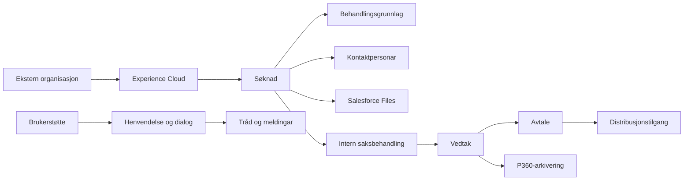

Det er viktig å forstå at dette ikkje er éin lineær applikasjon med eitt kontrollpunkt. Salesforce kombinerer fleire mekanismar:

- LWC og Apex for brukarflater og controllerlogikk.
- Flows for statusendringar, varsling, eigarskap og automatisering.
- Trigger-rammeverk for enkelte domenereglar og integrasjonsvern.
- Queueable, `@future` og andre async-mønster for callouts og bakgrunnsarbeid.
- Unlocked packages for felles plattform- og funksjonskapabilitetar.
- Experience Cloud for den eksterne brukarflata.

## 1. Repository- og packagegrensa

### 1.1 Hovudpakken

`force-app` er package directory for unlocked package `crm-arbeidsforhold`. Det er her produktendringar normalt skal gjerast.

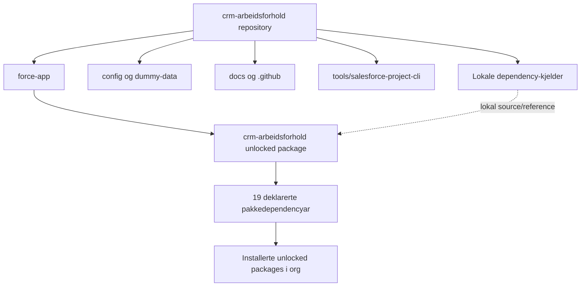

`force-app` inneheld fleire historiske organiseringsformer. Nye område bør følgje eigarskapsmodellen i [repositorystruktur.md](repositorystruktur.md), men eksisterande mapper skal ikkje flyttast berre for å gjere treet penare.

### 1.2 Kvifor finst dependency-mappene lokalt?

`sfdx-project.json` deklarerer både:

1. `force-app` som produktpakken.
2. Lokale package directories for dependency-kjelder.
3. Dei same pakkane som direkte `dependencies` under `force-app`.

Det betyr ikkje at dependency-koden er eigd av dette teamet. Repositoryreglane seier at dependency-mappene er read-only reference/package content. Dei kan lesast for å forstå kontraktar og plattformåtferd, men skal ikkje endrast utan særskilt godkjenning.

### 1.3 Dependency-roller

| Gruppe                       | Lokale pakkar                                                                                                   | Ansvar i heilskapen                                                                     |
| ---------------------------- | --------------------------------------------------------------------------------------------------------------- | --------------------------------------------------------------------------------------- |
| Plattform og data            | `platform-data-model`, `custom-metadata-dao`, `custom-permission-helper`, `feature-toggle`, `record-type-cache` | Felles datamodell, Custom Metadata, permissions, feature flags og cache av record types |
| Plattformgrunnmur            | `crm-platform-base`, `crm-platform-reporting`, `crm-platform-access-control`                                    | Logging, trigger-rammeverk, API-hjelparar, rapportering, deling og tilgangsstyring      |
| Integrasjon og kommunikasjon | `crm-platform-integration`, `crm-platform-email-scheduling`, `crm-journal-utilities`                            | Altinn/Kafka/PDL/KRR/Maskinporten, e-postplanlegging og journalrelaterte byggesteinar   |
| Ekstern brukarflate          | `crm-community-base`                                                                                            | Community-identitet, ID-porten-relaterte mønster, community-brukarar og filhandtering   |
| Dialog og henvending         | `crm-henvendelse-base`, `crm-henvendelse`, `crm-thread-view`, `crm-shared-timeline`                             | Henvendingar, meldingar, trådar, tidslinje, journalføring og redaksjonering             |
| Oppgåver og varsling         | `crm-platform-oppgave`, `crm-shared-flowComponents`, `crm-shared-user-notification`                             | Oppgåver, Flow-komponentar, SMS/e-post og brukarvarsling                                |

Dette er direkte dependency-roller basert på namn, README-ar og representative klassar. Den transitive grafen, altså kva kvar dependency sjølv er avhengig av, kan ikkje lesast komplett frå `sfdx-project.json` åleine.

### 1.4 Kva er ikkje produktkode?

- `src-temp` er eit package directory i manifestet, men er ikkje produktlogikken i `crm-arbeidsforhold`.
- `dummy-data/` er importdata for scratch-org og testscenario, ikkje produksjonsmetadata.
- `tools/salesforce-project-cli/` er eit eige Node/TypeScript-verktøy med eiga package-grense.
- `docs/` og `.github/` styrer forståing, arbeidsflyt, CI og dokumentasjon, men blir ikkje Salesforce-applikasjonskode.
- Genererte mapper som `api-docs/`, `dist/`, `web-dist/` og testresultat er artefakt, ikkje kjelde for domeneåtferd.

## 2. Eigarskap og lagdeling

Den normative retninga er å skilje mellom domene, integrasjonar, brukarflater og testar.

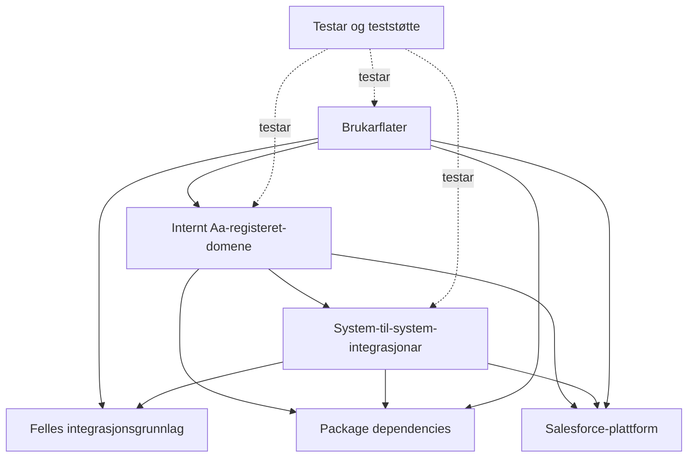

Dette er den ønskte eigarskapsmodellen. Den faktiske kodebasen er delvis eldre og har mange controller-/Flow-baserte grenser som ikkje følgjer modellen perfekt.

### 2.1 Domene

Domeneområda er dei interne omgrepa Salesforce eig:

- søknad: `Application__c`
- tilgangsførespurnad: `Access_Request__c`
- behandlingsgrunnlag: `ApplicationBasisCode__c`
- kontaktpersonar: `RelatedContact__c`
- vedtak: `Application_Decision__c`
- vedtaksdetaljar: `Application_Decision_Details__c`
- avtale: `Agreement__c`
- brukerstøtte/dialog: `Inquiry__c`, `Thread__c`, `Message__c`

Integrasjonar kan bruke desse objekta, men skal ikkje overta eigarskapet til domenereglane. Brukarflater viser og endrar data gjennom controllerar og Flow, men domenereglane kan også liggje i triggerar, Flow og eksisterande serviceklassar.

### 2.2 Integrasjonar

System-til-system-koplingar ligg under `force-app/integration`.

Representative område:

- `integration/p360`: arkivering til Public 360.
- `integration/distributionAccess`: distribusjonstilgang.
- `integration/common`: correlation context, logging, generelle exceptions og redaksjonering.
- Dependency `crm-platform-integration`: felles teknisk integrasjon mot blant anna Altinn, Kafka, PDL, KRR og Maskinporten.

### 2.3 Brukarflater

Brukarflater er delte i:

- `externalAccess/`, `externalApplication/`, `externalAgreement/`, `externalApplicationDecision/`: Experience Cloud og eksterne organisasjonar.
- `internalApplication/`, `internalApplicationAgreement/`, `internalApplicationDecision/`, `internalApplication/`: interne saksbehandlarflater.
- `main/default/lwc` og `main/default/flows`: felles eller historisk plasserte flater/automatiseringar.

Foldernamn og historisk struktur er ikkje heilt einsarta. Bruk eigarskapsdokumentasjonen og næraste komponent som fasit før du plasserer ny kode.

## 3. Datamodellen

Den sentrale relasjonsmodellen kan lesast slik:

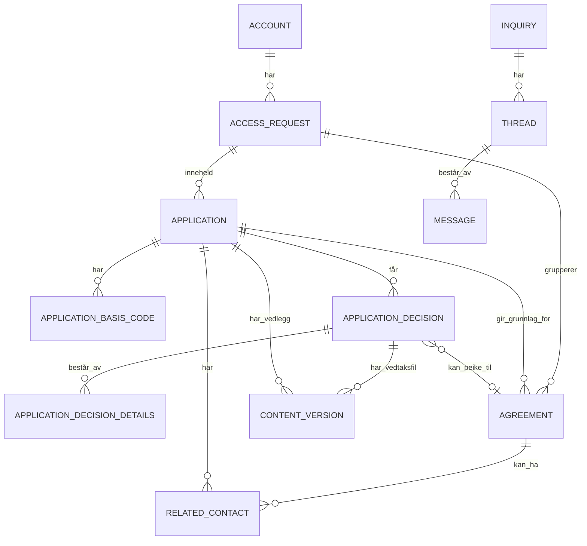

### 3.1 Typisk objektflyt

1. `Account` representerer organisasjonen og held organisasjonsnummer og organisasjonsstruktur.
2. `Access_Request__c` grupperer ein tilgangsprosess.
3. `Application__c` inneheld sjølve søknaden.
4. `ApplicationBasisCode__c` representerer eitt behandlingsgrunnlag/formål/lovheimel og tilgangstypar.
5. `RelatedContact__c` representerer kontaktpersonar og varslingsansvar.
6. `ContentVersion` og `ContentDocumentLink` representerer vedlegg og filer.
7. `Application_Decision__c` representerer eit vedtak.
8. `Application_Decision_Details__c` inneheld detaljane som driv summerte felt som tal godkjende grunnlag.
9. `Agreement__c` representerer avtalen som kan følgje av eit godkjent vedtak.
10. Distribusjonstenesta får tilgangsendringar basert på avtalen.

Relasjonane er avhengige av Salesforce metadata og kan ha krav frå master-detail, record type, Flow eller triggar. Diagrammet viser den konseptuelle modellen, ikkje ein full Salesforce-schema-export.

## 4. Hovudflyt A: ekstern søknad

### 4.1 Steg for steg

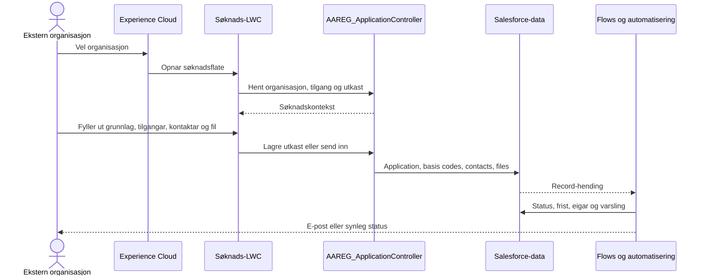

### 4.2 Kodeankera

- [AAREG_ApplicationController.cls](../../force-app/externalApplication/classes/AAREG_ApplicationController.cls) er Apex-grensa for den eksterne søknadsflata.
- [aareg_application.js](../../force-app/externalApplication/lwc/aareg_application/aareg_application.js) initialiserer organisasjon, utkast, kontaktar, grunnlag, filer og validering.
- [aareg_home.html](../../force-app/externalAccess/lwc/aareg_home/aareg_home.html) viser portalinngangar som ny søknad, eigne søknader, avtalar og brukerstøtte.
- [AAREG_populateApplicationFieldAfterSubmit.flow-meta.xml](../../force-app/main/default/flows/AAREG_populateApplicationFieldAfterSubmit.flow-meta.xml) er eit eksempel på etterbehandling etter innsending.

### 4.3 Handterte kanttilfelle

Verifisert eller tydeleg synleg i komponentane:

- brukar kan lagre utkast før innsending;
- eksisterande utkast kan hentast og opnast på nytt;
- innsending kan krevje e-post, bruksvilkår, minst eitt grunnlag og kontaktdekning;
- vedlegg blir validerte mot støtta filformat;
- søknad med status `Additional Information Required` kan redigerast og sendast inn på nytt;
- brukar utan nødvendig Altinn-rett viser ei eiga manglar-tilgang-flate;
- brukar kan ha fleire organisasjonar og må velje organisasjon.

Moglege eller dokumenterte gap:

- mykje av tilgangen blir avgjord i eldre `without sharing`-kode og må vurderast i org-kontekst;
- frontend-validering er ikkje aleine ein sikkerheitsgrense; Apex/Flow må framleis validere;
- `FileReader` les filinnhald i nettlesaren før innsending, og grenser for storleik/innhald må verifiserast mot serverlogikken;
- feil blir fleire stader berre logga med `console.error` eller vist som generell feil, så detaljert brukarrettleiing kan bli svak.

## 5. Hovudflyt B: intern saksbehandling og vedtak

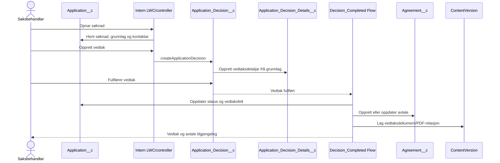

### 5.1 Kodeankera

- [AAREG_ApplicationInternalController.cls](../../force-app/internalApplication/classes/AAREG_ApplicationInternalController.cls) leverer intern søknadsdata.
- [aareg_applicationInternal.js](../../force-app/internalApplication/lwc/aareg_applicationInternal/aareg_applicationInternal.js) viser søknad, grunnlag og kontaktar.
- [AAREG_ApplicationDecisionController.cls](../../force-app/internalApplicationDecision/classes/AAREG_ApplicationDecisionController.cls) les og opprettar vedtak.
- [aareg_applicationInternalDecision.js](../../force-app/internalApplicationDecision/lwc/aareg_applicationInternalDecision/aareg_applicationInternalDecision.js) viser vedtak og tilbyr oppretting.
- [AAREG_Decision_Completed.flow-meta.xml](../../force-app/main/default/flows/AAREG_Decision_Completed.flow-meta.xml) er den sentrale automatiseringsankeret for ferdig vedtak.
- [AAREG_ApplicationDecisionPDFFileService.cls](../../force-app/internalApplicationDecision/classes/AAREG_ApplicationDecisionPDFFileService.cls) handterer PDF-/ContentVersion-fila.

### 5.2 Organisasjonstypar og edge cases

Testfabrikken viser at vedtakslogikken har eigne spor for `County`, `Municipality`, `Pension`, `Electricity Supervision`, `State` og `Other`. Grunnlag blir mappa til rett lovheimel og formål avhengig av organisasjonstype.

Tester dekkjer blant anna:

- vedtak med fleire basis-kodar;
- vedtak utan basis-kodar;
- kommune, fylke, stat, pensjon, el-tilsyn og `Other`;
- manglande record-id;
- manglande CRUD/FLS og describe-tilgang gjennom tvungne testgreiner;
- tomme resultat og feil som skal bli `AuraHandledException`.

Kjende risikoar:

- fleire testar fangar generelle exceptions og godtek at org-spesifikke automasjonar kan stoppe opprettinga; det gjer testen tolerant, men kan skjule reelle regresjonar;
- statusfelt er delvis formula-/rollup-/Flow-styrte, så ein verdi i dummy-data eller testfabrikk betyr ikkje nødvendigvis at heile statusflyten er verifisert;
- vedtaks- og tilgangslogikk er fordelt på controller, Flow, metadata og permission sets, ikkje ein einskild service.

## 6. Hovudflyt C: avtale og distribusjonstilgang

```mermaid
flowchart LR
    Decision[Vedtaksflyt] --> Agreement[Agreement__c]
    Agreement --> Portal[Ekstern avtalevisning]
    Agreement --> Flow[Agreement Flow]
    Flow --> Controller[AAREG_distributionAccessController]
    Controller --> Async[@future callout]
    Async --> Distribution[Distribusjonsteneste]
    Async --> Log[LoggerUtility / event logging]
```

### 6.1 Kodeankera

- [AAREG_MyAgreementsController.cls](../../force-app/externalAgreement/classes/AAREG_MyAgreementsController.cls) bygger avtaleinformasjon til ekstern brukar.
- [AAREG_Agreement.cls](../../force-app/externalAgreement/classes/AAREG_Agreement.cls) er wrapper-kontrakten til LWC.
- [AAREG_Agreement_create_distribution_access.flow-meta.xml](../../force-app/main/default/flows/AAREG_Agreement_create_distribution_access.flow-meta.xml) koplar Flow til distribusjonsoperasjonen.
- [AAREG_distributionAccessRequest.cls](../../force-app/integration/distributionAccess/classes/AAREG_distributionAccessRequest.cls) representerer callout-flyten.

### 6.2 Handterte og uavklarte kanttilfelle

Handtert:

- avtale kan vise API-, uttrekk- og webtilgang;
- kontaktpersonar og avtaleendringar blir eksponerte i ekstern flate;
- avslutting av avtale er ein eksplisitt flyt, ikkje nødvendigvis sletting av historikk;
- oppgåver under revisjon blir filtrerte på oppgåvetype og sorterte på opprettingstid.

Mindre tydeleg:

- eldre `@future(callout=true)`-flyt har ikkje same synlege lease-, retry- og idempotensmodell som P360;
- ved timeout eller delvis feil kan Salesforce-status og ekstern distribusjon kome ut av takt;
- kva som skjer ved gjentekne Flow-køyringar må lesast saman med Flow- og controllerimplementasjonen, ikkje antas frå UI-et.

## 7. Hovudflyt D: dialog og brukerstøtte

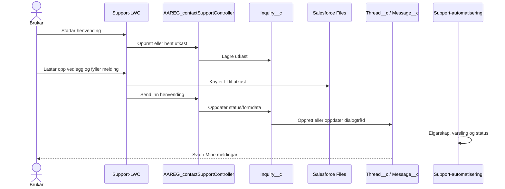

Brukerstøtteområdet brukar funksjonar frå både hovudpakkja og dependency-pakkar for henvending, trådvising, tidslinje, journalføring og varsling. Det er derfor eit godt eksempel på at domeneflyt og plattformkapabilitetar er vevde saman.

Kanttilfelle som er synlege i koden:

- utkast kan ha filer før innsending;
- fila kan relinkast når utkastet blir sendt;
- det finst ei grense på tal filer i den aktuelle brukarstøtteflyten;
- feil blir synlege som brukarfeil, men noko av feilhandsaminga er framleis generell.

## 8. Hovudflyt E: P360-arkivering

P360 er den mest eksplisitt lagdelte delen av løysinga.

```mermaid
flowchart LR
    Event[Vedtak/file-hending]
    Trigger[P360 trigger]
    Guard[Archive guard]
    JobService[ArchiveJobService]
    Job[(P360_Archive_Job__c)]
    Claim[Claim + lease]
    Worker[Queueable worker]
    Factory[AdapterFactory]
    Adapter[Archive adapter]
    Rpc[RPC client]
    Public360[Public 360]

    Event --> Trigger --> Guard --> JobService --> Job
    Job --> Claim --> Worker --> Factory --> Adapter --> Rpc -.-> Public360
```

### 8.1 Steg for steg

1. Eit vedtak eller ein filhending blir fanga av trigger/MyTriggers.
2. Guarden kontrollerer einvegs frigiving og permission.
3. Jobbservicen lagar ein idempotent `P360_Archive_Job__c`-rad.
4. `P360_IdempotencyKey` sikrar stabil nøkkel for søknadsdokument, vedlegg, vedtaksdokument og avtaledokument.
5. Claim-servicen tek ein lease og aukar forsøksteljaren.
6. Queueable-workeren kallar adapteren.
7. Factory vel stub eller reell adapter ut frå konfigurasjon.
8. Adapteren isolerer P360-kontrakten frå resten av Salesforce.
9. Feil blir klassifiserte som suksess, retrybar feil eller manuell oppfølging.

### 8.2 Status og avgrensing

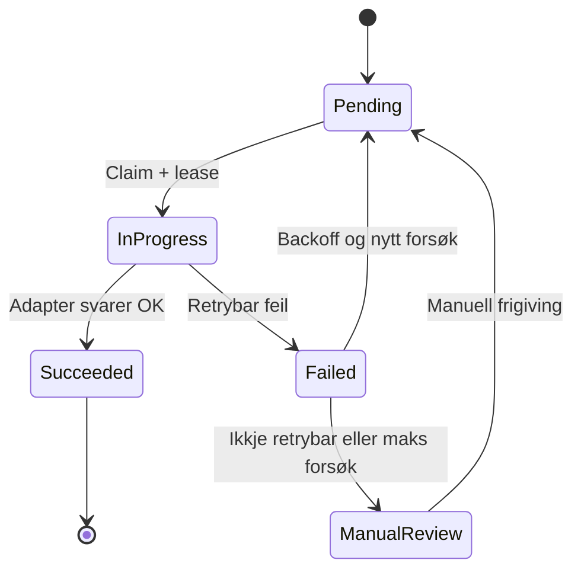

Verifisert bygd:

- DTO-ar, exceptions, mapperar, kodeverk, correlation ID og loggingredaksjonering;
- release guard og låsing av vedtak;
- idempotent jobboppretting;
- claim/lease og retry-backoff;
- teststub og constructor injection;
- mock-kompatibel orchestratorflyt.

Ikkje ferdig eller eksternt blokkert:

- endeleg SIF RPC-endepunkt og authmodell;
- endeleg Salesforce-til-P360-mapping og kodeverk;
- filstrategi og live upload;
- full kopling av automatisk jobbtriggering og scheduler;
- integrasjonstest mot P360-miljø.

Sjå [P360 teknisk oversikt](../integrations/p360/teknisk-oversikt.md) for den autoritative detaljstatusen.

## 9. Sikkerheit, tilgang og datagrense

### 9.1 Tilgangslaga

Tilgang kjem frå fleire kjelder samtidig:

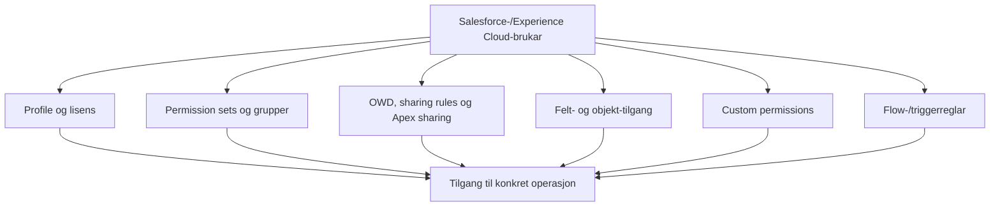

Verifiserte mønster:

- domeneobjekt er i stor grad private;
- vedtak og detaljar kan vere `ControlledByParent`;
- permission sets skil saksbehandling, support, community og P360-prosessering;
- P360-release krev custom permission og skal ikkje kunne bypassast gjennom generelt trigger-bypass;
- nyare kode brukar `with sharing`, USER_MODE og FLS-kontrollar fleire stader.

Viktig edge case:

Eldre Experience Cloud-kode brukar `without sharing` medvite eller historisk. Ein må derfor ikkje konkludere med at `with sharing` i nyare servicekode betyr at heile løysinga har same sikkerheitsmodell. Tilgang må vurderast ved kvar inngang: LWC/Apex, Flow, trigger, permission set, sharing og integrasjon.

### 9.2 Persondata og logging

Løysinga behandlar organisasjonsdata, kontaktdata, søknadsgrunnlag, filer og vedtaksinformasjon. Integrasjonslogging skal ikkje lekke tokens, auth-headerar, cookies eller nasjonale identifikatorar.

P360/common-delen har eksplisitt loggingkontekst, correlation ID og redaksjonering. Eldre flytar brukar meir varierande loggingmønster. Dette er eit viktig skilje ved feilsøking og sikkerheitsreview.

## 10. Async, transaksjonar og konsistens

Salesforce-transaksjonen og eksterne system er ikkje atomiske saman.

Typiske mekanismar:

| Mekanisme               | Bruk                                              | Risiko/edge case                                                      |
| ----------------------- | ------------------------------------------------- | --------------------------------------------------------------------- |
| Flow                    | Status, eigarskap, varsling, avtale og oppfølging | Rekursive/dupliserte hendingar, Flow-feil etter delvis DML            |
| Trigger/MyTriggers      | Guarden, release, registrering                    | Bypass, triggerrekkefølgje og feltlås må vere eksplisitt              |
| `@future(callout=true)` | Eldre distribusjons-callouts                      | Ingen naturleg lease/idempotensmodell; ekstern status kan henge etter |
| Queueable               | P360-worker og kontrollert bakgrunnsarbeid        | Jobben kan feile etter claim; lease/retry må handtere dette           |
| Platform Event          | Logging via plattformgrunnmur                     | Eventual consistency og avhengig Flow-/event-prosessering             |
| ContentVersion          | Vedlegg og vedtaksfiler                           | Filstorleik, relasjonar, dobbel opplasting og manglande cleanup       |

Den nye P360-jobbmodellen har tydelegare konsistensstrategi enn eldre callout-flytar. Det er ikkje ein generell konsistensmekanisme for alle integrasjonar i repoet.

## 11. Teststrategi og CI

### 11.1 Testlag

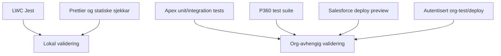

Verifisert:

- LWC/Jest kan køyrast lokalt utan Salesforce-org.
- Apex-kompilering og Apex-testar krev org og riktig dependency-/metadata-state.
- P360 har eiga testsuite og meir systematisk testdekning.
- GitHub Actions har separate workflowar for PR-validering, LWC-validering, scratch-org, package creation, deployment og promotion.
- `tools/salesforce-project-cli` har eiga Node/TypeScript-testmatrise og er uavhengig av Apex-testane.

### 11.2 Kva testar ikkje viser

Lokale Jest-testar viser ikkje:

- Apex-kompilering mot aktuell API-versjon;
- FLS, sharing og permission set i ein faktisk org;
- Flow- og triggerrekkefølgje;
- Named Credential, callout eller external credential;
- pakkeinstallasjon og dependency-versjonar;
- Salesforce Files-relasjonar under faktisk org-automatisering.

Apex-testar som toler org-spesifikke exceptions kan gi robust CI, men kan også skjule at ein viktig suksessflyt ikkje blei gjennomført. Dette må lesast saman med testresultat og org-logg.

## 12. Edge cases: kva blir handtert og kva blir ikkje handtert

### Handtert i kode eller metadata

- utkast, innsending og innsending av ekstra informasjon;
- manglande Altinn-rett og manglande organisasjonsval;
- ulike organisasjonstypar i vedtaksdetaljar;
- manglande CRUD/FLS/describe i fleire controller-testar;
- avtaleavslutting og revisjonsoppgåver;
- filer knytte til søknad, avtale og vedtak;
- idempotent P360-jobboppretting og duplicate race;
- retrybar versus ikkje-retrybar P360-feil;
- manuell oppfølging etter maksimalt tal forsøk;
- redaksjonering av sensitive tekniske loggfelt;
- invalid eller ufullstendig `sf-project`-konfigurasjon;
- manglande lokale dependency-mapper når verktøyet er konfigurert med `requireLocalDirectories: false`.

### Delvis handtert eller uverifisert

- konsistens mellom Salesforce og eksternt distribusjonssystem etter timeout eller delvis feil;
- full scheduler-/retrystrategi for eldre callout-flytar;
- ende-til-ende P360-transport, auth og filopplasting;
- org-spesifikk Flow-rekkefølgje og automatisering ved alle statusovergangar;
- full LWC-dekning for talet på komponentar og brukarflater;
- faktisk package-installasjon og transitive dependency-graf i kvar miljøvariant;
- tilgangskontroll i eldre `without sharing`-controllerar;
- storleik, virus-/innhaldsvalidering og cleanup for alle filflytar.

## 13. Slik bør ein lese vidare

### Først: oversikta

1. [CONTEXT.md](../../CONTEXT.md)
2. [sfdx-project.json](../../sfdx-project.json)
3. [Arkitektur og design](README.md)
4. [Repositorystruktur](repositorystruktur.md)
5. [Arbeidsflyt og dokumentasjon](../arbeidsflyt-og-dokumentasjon.md)

### Deretter: ein konkret brukarreise

- Ekstern søknad: [AAREG_ApplicationController.cls](../../force-app/externalApplication/classes/AAREG_ApplicationController.cls) og [aareg_application.js](../../force-app/externalApplication/lwc/aareg_application/aareg_application.js)
- Intern søknad: [AAREG_ApplicationInternalController.cls](../../force-app/internalApplication/classes/AAREG_ApplicationInternalController.cls)
- Vedtak: [AAREG_ApplicationDecisionController.cls](../../force-app/internalApplicationDecision/classes/AAREG_ApplicationDecisionController.cls) og [AAREG_Decision_Completed.flow-meta.xml](../../force-app/main/default/flows/AAREG_Decision_Completed.flow-meta.xml)
- Avtale: [AAREG_MyAgreementsController.cls](../../force-app/externalAgreement/classes/AAREG_MyAgreementsController.cls)
- Dialog: [AAREG_contactSupportController.cls](../../force-app/dialog/classes/AAREG_contactSupportController.cls)
- P360: [teknisk oversikt](../integrations/p360/teknisk-oversikt.md) og [P360 adapterval](../integrations/p360/di-og-adapterval.md)

### Til slutt: verifisering

- LWC: `npm test -- --runInBand`
- Formatering: `npm run prettier:check`
- Salesforce: org-avhengig deploy preview, kompilering og fokuserte Apex-testar mot godkjend org
- Dependencies: les `sfdx-project.json`, package READMEs og permission-/metadata-kontraktar før du endrar eigarskap eller API

## Avsluttande vurdering

Dette er ei moden, funksjonell Salesforce-løysing med mange ferdige arbeidsflytar, men ikkje ein einsarta nyarkitektur. Den viktigaste forståingsnøkkelen er å sjå samanhengen mellom Salesforce-objekt, Flow, Apex-controllerar, Experience Cloud, permission sets og package dependencies.

P360 viser den retninga ny integrasjonskode bør ta: eksplisitte lag, adaptergrense, mapping, correlation ID, idempotens og kontrollert retry. Eldre søknads-, avtale- og distribusjonsflytar fungerer som produktets historiske grunnmur, men har meir spreiing av ansvar og større variasjon i sikkerheit, feilhandtering og async-konsistens.

Alle vurderingar i dette dokumentet må lesast med Salesforce-org som ein eigen verifikasjonsgrense. Kode kan vise intensjon og lokal logikk; metadata, installed packages, Flow-køyring, sharing og org-konfigurasjon avgjer faktisk åtferd i miljøet.
