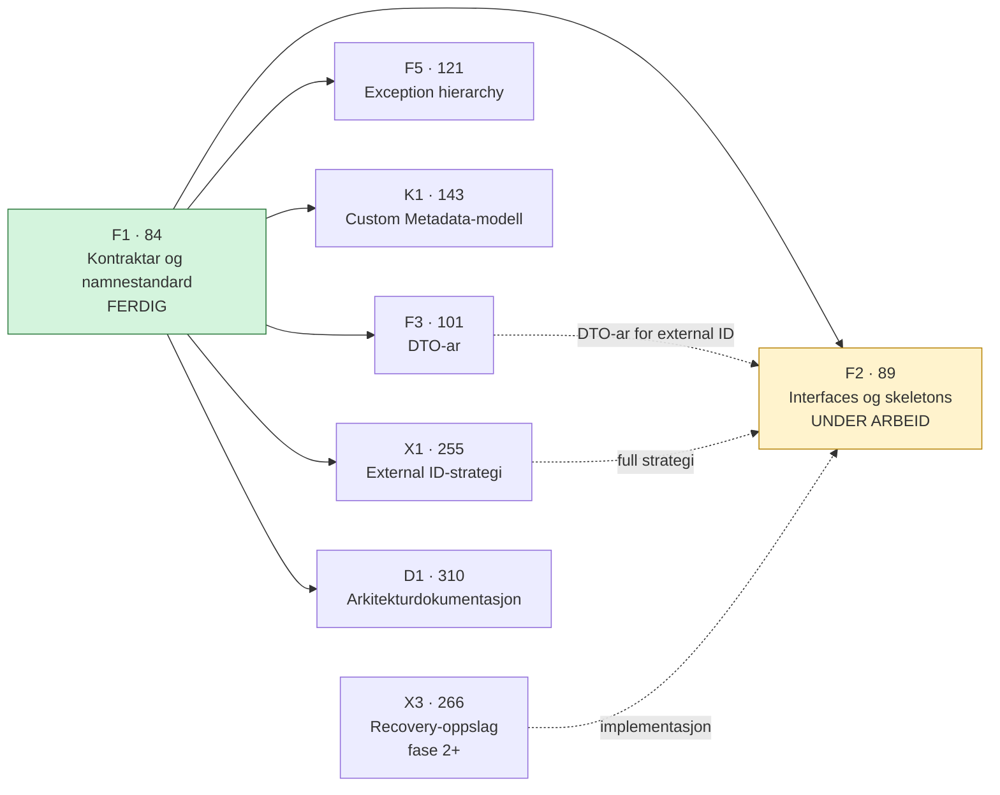

# Jira-oversikt for P360-integrasjonen

Prosjekt `CRMAAREG` — CRM Arbeidsforhold. 11 epicar og 34 historier per 2026-09-08.

Full tekst for kvar epic og historie ligg i [jira/](jira/README.md). Denne fila er analysen: status, avhengigheiter og avvik.

Alle epicar har prefikset `SF/P360 - ` i Jira-feltet «Navn på epic», men ikkje i sammendraget. Prefikset er utelate under.

## Status samla

| Status       | Tal |
| ------------ | --- |
| Ferdig       | 1   |
| Under arbeid | 1   |
| Backlog      | 43  |

Berre F1 er levert. F2 er i arbeid. Alt anna ligg i backlog.

## Epicar

| Epic                                                          | Tittel                                             | Prioritet   | Historier |
| ------------------------------------------------------------- | -------------------------------------------------- | ----------- | --------- |
| [CRMAAREG-83](https://nav.atlassian.net/browse/CRMAAREG-83)   | Teknisk grunnmur og integrasjonskontraktar         | A - Kritisk | F1–F7     |
| [CRMAAREG-142](https://nav.atlassian.net/browse/CRMAAREG-142) | Kodeverk, metadata-adapter og dependency injection | Medium      | K1–K5     |
| [CRMAAREG-180](https://nav.atlassian.net/browse/CRMAAREG-180) | Sikkerheit, autentisering og konfigurasjon         | Medium      | S1–S2     |
| [CRMAAREG-194](https://nav.atlassian.net/browse/CRMAAREG-194) | Sakssynk mellom Salesforce og P360                 | Medium      | C1–C3     |
| [CRMAAREG-215](https://nav.atlassian.net/browse/CRMAAREG-215) | Journalpost som document metadata-flyt             | Medium      | J1–J3     |
| [CRMAAREG-236](https://nav.atlassian.net/browse/CRMAAREG-236) | Filhandtering og vedleggsflyt                      | Medium      | FLS1–FLS3 |
| [CRMAAREG-254](https://nav.atlassian.net/browse/CRMAAREG-254) | External ID-strategi og oppslag                    | Medium      | X1–X3     |
| [CRMAAREG-267](https://nav.atlassian.net/browse/CRMAAREG-267) | Feilhåndtering, idempotens og retry                | Medium      | R1–R2     |
| [CRMAAREG-283](https://nav.atlassian.net/browse/CRMAAREG-283) | Logging, overvaking og drift                       | Medium      | O1–O2     |
| [CRMAAREG-295](https://nav.atlassian.net/browse/CRMAAREG-295) | Test, kvalitet og verifikasjon                     | Medium      | T1–T2     |
| [CRMAAREG-309](https://nav.atlassian.net/browse/CRMAAREG-309) | Arkitektur, dokumentasjon og overlevering          | Medium      | D1–D2     |

## Historier

### CRMAAREG-83 — Teknisk grunnmur og integrasjonskontraktar

| Nøkkel                                                        | ID  | Tittel                                                        | Status           | Prioritet   | Estimat |
| ------------------------------------------------------------- | --- | ------------------------------------------------------------- | ---------------- | ----------- | ------- |
| [CRMAAREG-84](https://nav.atlassian.net/browse/CRMAAREG-84)   | F1  | Etablere integrasjonskontraktar og namnestandard              | **Ferdig**       | A - Kritisk | S       |
| [CRMAAREG-89](https://nav.atlassian.net/browse/CRMAAREG-89)   | F2  | Opprette domeneinterfaces og service skeletons                | **Under arbeid** | A - Kritisk | M       |
| [CRMAAREG-101](https://nav.atlassian.net/browse/CRMAAREG-101) | F3  | Opprette request/response DTO-ar og interne Apex data classes | Backlog          | A - Kritisk | M       |
| [CRMAAREG-115](https://nav.atlassian.net/browse/CRMAAREG-115) | F4  | Opprette omformar (mapper) skeletons                          | Backlog          | A - Kritisk | S/M     |
| [CRMAAREG-121](https://nav.atlassian.net/browse/CRMAAREG-121) | F5  | Etablere exception hierarchy og feilmodell                    | Backlog          | A - Kritisk | S       |
| [CRMAAREG-129](https://nav.atlassian.net/browse/CRMAAREG-129) | F6  | Etablere logging helper og correlation ID-støtte              | Backlog          | A - Kritisk | M       |
| [CRMAAREG-135](https://nav.atlassian.net/browse/CRMAAREG-135) | F7  | Opprette mock/fake services og basis test classes             | Backlog          | A - Kritisk | M       |

### CRMAAREG-142 — Kodeverk, metadata-adapter og dependency injection

| Nøkkel                                                        | ID  | Tittel                                                        | Status  | Prioritet         | Estimat |
| ------------------------------------------------------------- | --- | ------------------------------------------------------------- | ------- | ----------------- | ------- |
| [CRMAAREG-143](https://nav.atlassian.net/browse/CRMAAREG-143) | K1  | Etablere Custom Metadata-modell for P360-kodeverk             | Backlog | A - Kritisk       | S       |
| [CRMAAREG-155](https://nav.atlassian.net/browse/CRMAAREG-155) | K2  | Implementere metadata-basert code table service               | Backlog | A - Kritisk       | M       |
| [CRMAAREG-163](https://nav.atlassian.net/browse/CRMAAREG-163) | K3  | Etablere dependency injection / service locator for adapterar | Backlog | A - Kritisk       | S       |
| [CRMAAREG-169](https://nav.atlassian.net/browse/CRMAAREG-169) | K4  | Laste initiale kodeverk-verdiar i Salesforce                  | Backlog | A - Kritisk       | M       |
| [CRMAAREG-175](https://nav.atlassian.net/browse/CRMAAREG-175) | K5  | Planleggje RPC-basert code table adapter for seinare fase     | Backlog | C - Mindre viktig | S       |

### CRMAAREG-180 — Sikkerheit, autentisering og konfigurasjon

| Nøkkel                                                        | ID  | Tittel                                                 | Status  | Prioritet   | Estimat |
| ------------------------------------------------------------- | --- | ------------------------------------------------------ | ------- | ----------- | ------- |
| [CRMAAREG-181](https://nav.atlassian.net/browse/CRMAAREG-181) | S1  | Etablere Named Credential / auth-strategi for P360 RPC | Backlog | A - Kritisk | M       |
| [CRMAAREG-188](https://nav.atlassian.net/browse/CRMAAREG-188) | S2  | Etablere integrasjonsbrukar, tilgang og audit-prinsipp | Backlog | A - Kritisk | M       |

### CRMAAREG-194 — Sakssynk mellom Salesforce og P360

| Nøkkel                                                        | ID  | Tittel                                     | Status  | Prioritet   | Estimat |
| ------------------------------------------------------------- | --- | ------------------------------------------ | ------- | ----------- | ------- |
| [CRMAAREG-195](https://nav.atlassian.net/browse/CRMAAREG-195) | C1  | Avklare forretningsreglar for sak          | Backlog | A - Kritisk | M       |
| [CRMAAREG-200](https://nav.atlassian.net/browse/CRMAAREG-200) | C2  | Opprette P360-sak frå Salesforce           | Backlog | B - Viktig  | L       |
| [CRMAAREG-208](https://nav.atlassian.net/browse/CRMAAREG-208) | C3  | Oppdatere P360-sak ved relevante endringar | Backlog | B - Viktig  | M       |

### CRMAAREG-215 — Journalpost som document metadata-flyt

| Nøkkel                                                        | ID  | Tittel                                                            | Status  | Prioritet  | Estimat |
| ------------------------------------------------------------- | --- | ----------------------------------------------------------------- | ------- | ---------- | ------- |
| [CRMAAREG-216](https://nav.atlassian.net/browse/CRMAAREG-216) | J1  | Avklare forretningsreglar for journalpost                         | Backlog | B - Viktig | M       |
| [CRMAAREG-221](https://nav.atlassian.net/browse/CRMAAREG-221) | J2  | Opprette journalpost i Salesforce-domene via P360 DocumentService | Backlog | Medium     | L       |
| [CRMAAREG-229](https://nav.atlassian.net/browse/CRMAAREG-229) | J3  | Oppdatere journalpostmetadata i P360                              | Backlog | B - Viktig | M       |

### CRMAAREG-236 — Filhandtering og vedleggsflyt

| Nøkkel                                                        | ID   | Tittel                                           | Status  | Prioritet         | Estimat |
| ------------------------------------------------------------- | ---- | ------------------------------------------------ | ------- | ----------------- | ------- |
| [CRMAAREG-237](https://nav.atlassian.net/browse/CRMAAREG-237) | FLS1 | Avklare filstrategi for MVP                      | Backlog | B - Viktig        | M       |
| [CRMAAREG-242](https://nav.atlassian.net/browse/CRMAAREG-242) | FLS2 | Leggje til filer på dokument i P360              | Backlog | B - Viktig        | L       |
| [CRMAAREG-250](https://nav.atlassian.net/browse/CRMAAREG-250) | FLS3 | Handtere store filer og seinare avansert filflyt | Backlog | C - Mindre viktig | S       |

### CRMAAREG-254 — External ID-strategi og oppslag

| Nøkkel                                                        | ID  | Tittel                                                          | Status  | Prioritet         | Estimat |
| ------------------------------------------------------------- | --- | --------------------------------------------------------------- | ------- | ----------------- | ------- |
| [CRMAAREG-255](https://nav.atlassian.net/browse/CRMAAREG-255) | X1  | Etablere external ID strategy for case, journalpost og file     | Backlog | B - Viktig        | M       |
| [CRMAAREG-261](https://nav.atlassian.net/browse/CRMAAREG-261) | X2  | Implementere lookup i Salesforce basert på lagra eksterne ID-ar | Backlog | B - Viktig        | M       |
| [CRMAAREG-266](https://nav.atlassian.net/browse/CRMAAREG-266) | X3  | Planleggje P360 external ID recovery-oppslag for seinare fase   | Backlog | C - Mindre viktig | S       |

### CRMAAREG-267 — Feilhåndtering, idempotens og retry

| Nøkkel                                                        | ID  | Tittel                                                   | Status  | Prioritet  | Estimat |
| ------------------------------------------------------------- | --- | -------------------------------------------------------- | ------- | ---------- | ------- |
| [CRMAAREG-268](https://nav.atlassian.net/browse/CRMAAREG-268) | R1  | Etablere idempotens for oppretting av sak og journalpost | Backlog | B - Viktig | M       |
| [CRMAAREG-274](https://nav.atlassian.net/browse/CRMAAREG-274) | R2  | Etablere retry-strategi og manuell oppfølging            | Backlog | Medium     | M       |

### CRMAAREG-283 — Logging, overvaking og drift

| Nøkkel                                                        | ID  | Tittel                                                 | Status  | Prioritet  | Estimat |
| ------------------------------------------------------------- | --- | ------------------------------------------------------ | ------- | ---------- | ------- |
| [CRMAAREG-284](https://nav.atlassian.net/browse/CRMAAREG-284) | O1  | Instrumentere alle hovudflytar med strukturert logging | Backlog | B - Viktig | M       |
| [CRMAAREG-290](https://nav.atlassian.net/browse/CRMAAREG-290) | O2  | Etablere overvaking, alarmar og runbook                | Backlog | B - Viktig | M       |

### CRMAAREG-295 — Test, kvalitet og verifikasjon

| Nøkkel                                                        | ID  | Tittel                                    | Status  | Prioritet   | Estimat |
| ------------------------------------------------------------- | --- | ----------------------------------------- | ------- | ----------- | ------- |
| [CRMAAREG-296](https://nav.atlassian.net/browse/CRMAAREG-296) | T1  | Etablere einingstestar og kontraktstestar | Backlog | A - Kritisk | M       |
| [CRMAAREG-303](https://nav.atlassian.net/browse/CRMAAREG-303) | T2  | Etablere integrasjonstest mot miljø       | Backlog | A - Kritisk | L       |

### CRMAAREG-309 — Arkitektur, dokumentasjon og overlevering

| Nøkkel                                                        | ID  | Tittel                                            | Status  | Prioritet  | Estimat |
| ------------------------------------------------------------- | --- | ------------------------------------------------- | ------- | ---------- | ------- |
| [CRMAAREG-310](https://nav.atlassian.net/browse/CRMAAREG-310) | D1  | Dokumentere arkitektur, sekvensar og tekniske val | Backlog | B - Viktig | M       |
| [CRMAAREG-315](https://nav.atlassian.net/browse/CRMAAREG-315) | D2  | Dokumentere drift, støtte og overlevering         | Backlog | B - Viktig | M       |

## Avhengigheiter

Kjelde: `issuelinks` i XML-eksporten av CRMAAREG-84, og eksplisitte referansar i historiebeskrivingane.



Merk at F1 er registrert som ferdig medan seks historier som er avhengige av han framleis ligg i backlog.

### Kva som faktisk er bygd

F2 er lenger komen enn epic-statusen tilseier. Ti av tolv deloppgåver er ferdige, og koden ligg i repoet på branch `P360IntegrationWork`:

```
force-app/integration/p360/classes/
  orchestration/   AAREG_ArchiveApplicationOrchestrator, ...Command, ...Result
  domain/          AAREG_ApplicationDomainService, AAREG_AgreementDomainService
  adapter/         P360_IArchiveAdapter, P360_ArchiveAdapter, P360_StubArchiveAdapter
  client/          P360_IRpcClient, P360_RpcClient
  contract/dto/    P360_ArchiveRequestDto, P360_ArchiveResponseDto, P360_RpcRequest, P360_RpcResponse
  exception/       P360_IntegrationException, P360_ContractException, P360_TransportException
```

**17 klassar.** Mappestrukturen samsvarer eksakt med ADR-0001. Namnestandarden er følgd utan avvik. Klassane har ApexDoc, `with sharing` og constructor injection.

Exception-klassane er tomme `extends Exception` med kommentaren `TODO F5` — medvitne placeholders frå CRMAAREG-321, ikkje ferdig arbeid.

`force-app/integration/common/` finst, men inneheld berre README-filer. `force-app/tests/` finst ikkje.

Sjå [jira-deloppgaver.md](jira-deloppgaver.md) for deloppgåvenivå.

### Ikkje-verifiserte avhengigheiter

XML-eksporten for `issuelinks` finst berre for CRMAAREG-84. Følgjande er utleidde frå tekst, ikkje frå Jira-lenkjer, og bør stadfestast:

- K5 → SupportService/GetCodeTableRows (framtidig fase)
- X3 → GetEntitiesExternalIds (framtidig fase)
- C2, J2, FLS2 avheng truleg av F2–F7, S1, X1 og K2, men det er ikkje registrert som lenkjer

## P360 API-detaljar nemnde i Jira

Desse operasjonane er nemnde i historiebeskrivingane. Dei er ikkje dokumenterte i noka speilkopi frå Confluence, og er relevante for GitHub-sak #983.

| Operasjon / teneste                   | Nemnd i | Bruk                                     |
| ------------------------------------- | ------- | ---------------------------------------- |
| `DocumentService`                     | J2      | Opprette journalpost i P360              |
| `CreateDocument`                      | J2      | Journalpost mappar til denne operasjonen |
| `SupportService` / `GetCodeTableRows` | K5      | Framtidig RPC-basert kodeverksoppslag    |
| `GetEntitiesExternalIds`              | X3      | Framtidig external ID-recovery           |
| `UploadStream`                        | FLS3    | Framtidig flyt for store filer           |

Kodeverkstypar nemnde i K2 og K4: document categories, document statuses, case statuses.

Felt nemnde i K1: Salesforce-nøkkel, P360-kode, `recno`, visingslabel, språk, aktiv/inaktiv.

## Avvik mot Confluence-dokumentasjonen

### 1. Klassenamn i K2 følgjer ikkje namnestandarden

K2 (CRMAAREG-155) namngir:

```text
IP360CodeTableService
P360CodeTableMetadataService
```

Namnestandarden i `docs/architecture/arkitekturprinsipp-lagdeling-og-namnestandard.md` krev prefiks skilt med underscore, og interface-markøren `I` etter prefikset:

```text
P360_ICodeTableService
P360_CodeTableMetadataService
```

Jira-namna manglar underscore og set `I` føre prefikset. Dette bryt både Platforce-standarden og ADR-0001.

**Merk:** K2 er skriven 2026-03-17. F1, som etablerte namnestandarden, blei først levert 2026-04-24. Avviket er truleg berre eit rekkjefølgjeproblem, men storien er ikkje oppdatert i ettertid.

### 2. Exception-lista i F5 er ikkje den same som i Confluence

F5 (CRMAAREG-121) listar exceptions for: auth, validering, timeout, integrasjonsfeil, manglande mapping og retrybar feil.

Confluence og ADR-0001 listar: `IntegrationException`, `ConfigurationException`, `TransportException`, `MappingException`, pluss `P360_ContractException` og `P360_ConfigException`.

Overlappet er delvis. Jira nemner auth, validering, timeout og retrybar — som ikkje har eigne klassar i Confluence-hierarkiet. Confluence nemner Configuration og Contract — som ikkje står i F5.

Dette må avklarast før #976 blir implementert, elles byggjer vi eit hierarki som ikkje dekkjer det F5 ber om.

### 3. F5 krev at retrybar og ikkje-retrybar feil kan skiljast

Confluence-dokumentasjonen seier at exceptions skal støtte correlation ID, men seier ikkje noko om retrybarheit som eigenskap på exception-klassen. F5 gjer det til eit akseptkriterium.

### 4. Epic CRMAAREG-194 manglar beskriving

«Ingen beskrivelse registrert» i CSV-en. Dei ti andre epicane har formål og grunngjeving.

## Merknader ved speiling

- **Tildelte personar og account-ID-ar er utelatne.** Alle saker har same rapportør og for det meste same tildelte. Sjå GitHub-sak #990 for policyen.
- Estimat er T-skjorte-storleikar. Story Points er 0.0 på alle saker og er ikkje i bruk.
- Sub-taskar er ikkje eksporterte. CRMAAREG-84 har fire (85, 86, 87, 88) som ikkje er dekte her.
- Feltet «Kontrollpunktstatus» er `BL - Ikke vurdert` på alle saker.
