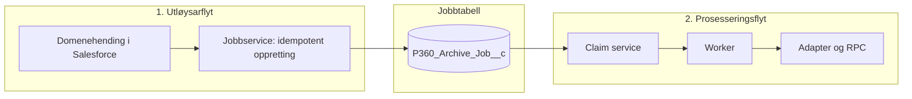
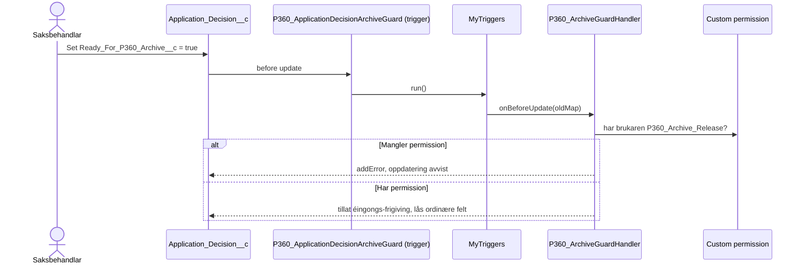
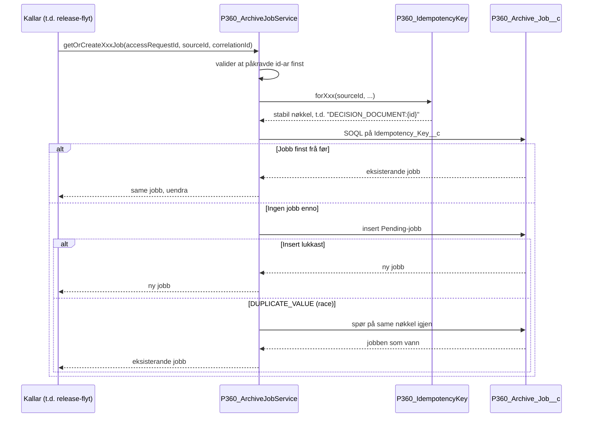
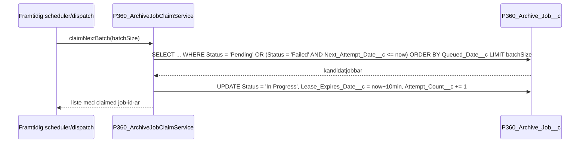
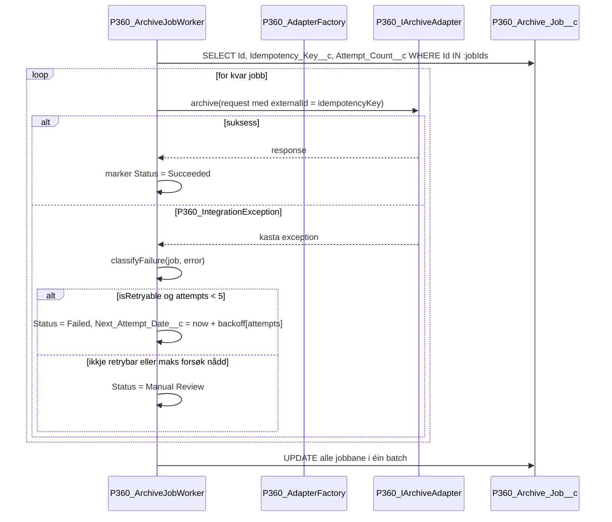
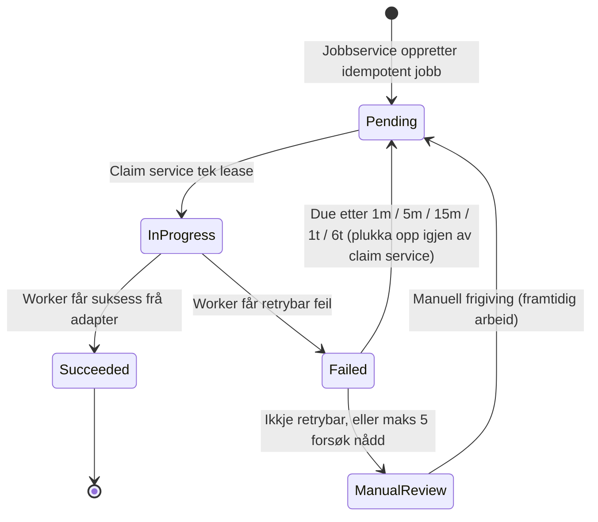
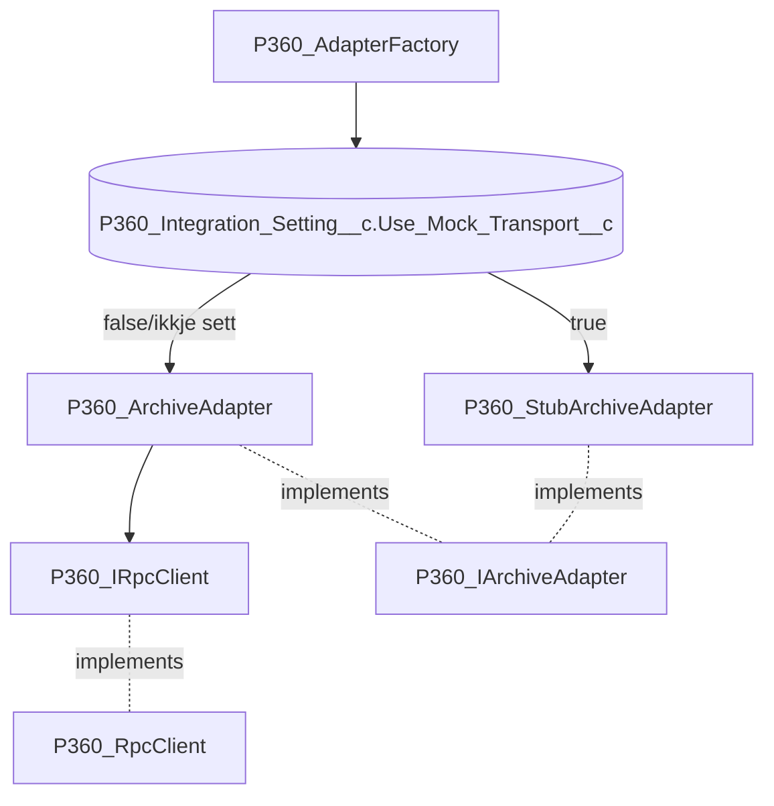
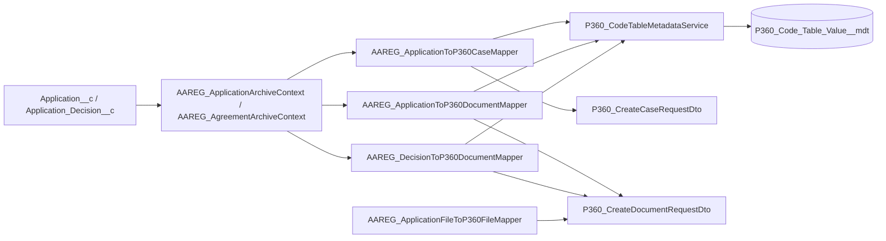
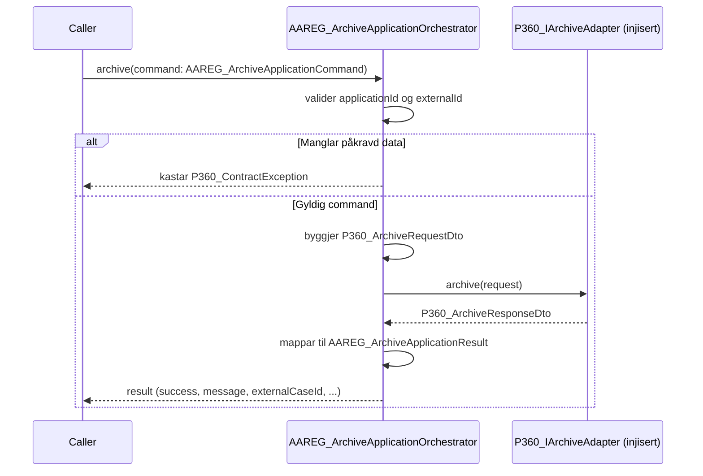
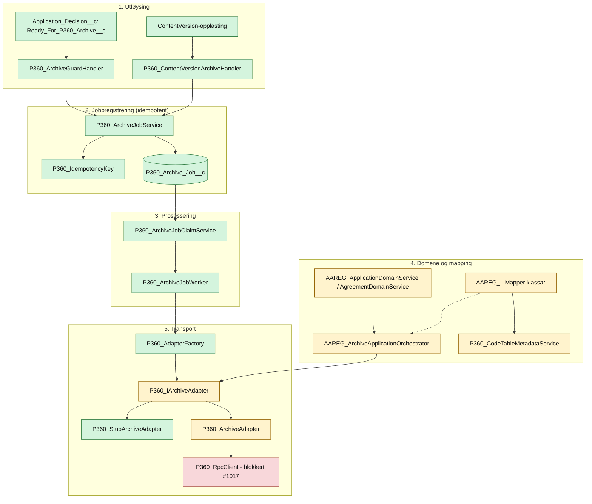

# P360-integrasjonen steg for steg

Dette dokumentet er ein pedagogisk gjennomgang av P360-arkiveringsintegrasjonen: kva som er bygd, kvifor det er strukturert slik, og korleis dei ulike klassane heng saman frå eit Salesforce-felt blir sett til ein jobb er ferdig prosessert (eller feila).

Målet er at du skal kunne følgje éin konkret flyt gjennom koden, steg for steg, i staden for berre å lese statuslister. For status og "kva manglar", sjå [teknisk-oversikt.md](teknisk-oversikt.md). Dette dokumentet forklarer **korleis** det som finst heng saman.

## 1. Grunntanken: to separate flytar som møtest i ein jobbkø

Integrasjonen er delt i to flytar som er heilt uavhengige av kvarandre inntil dei møtest i tabellen `P360_Archive_Job__c`:

1. **Utløysarflyten** — noko skjer i Salesforce (eit vedtak blir frigitt, ein fil blir lasta opp) og det skal føre til at ei arkivhending blir registrert.
2. **Prosesseringsflyten** — ein bakgrunnsjobb plukkar opp registrerte hendingar og prøver å sende dei til P360.

Dette skiljet er bevisst: utløysaren treng aldri å vente på at P360 svarer, og prosesseringa treng ikkje vite kva som opphavleg utløyste jobben. Dei to sidene deler berre eitt kontraktspunkt — jobbraden sjølv, identifisert med ein idempotensnøkkel.

## 2. Steg 1 — noko skjer: frigiving av vedtak

Flyten startar oftast med at ein saksbehandlar set `Ready_For_P360_Archive__c = true` på `Application_Decision__c`. Dette er eit **einvegs forretningssignal**, ikkje eit vanleg felt.

**Kvifor slik?**

- Triggeren (`P360_ApplicationDecisionArchiveGuard.trigger`) inneheld **ingen forretningslogikk**. Han berre delegerer til MyTriggers-rammeverket, som slår opp `P360_ArchiveGuardHandler` via `MyTriggerSetting__mdt`. Dette er det etablerte mønsteret i repoet — trigger-logikk skal aldri stå direkte i `.trigger`-fila.
- Guarden er registrert med `IsBypassAllowed__c = false`. Det tyder at ein generell MyTriggers-bypass-permission (brukt t.d. til dataload) **ikkje** kan omgå frigivingskontrollen. Dette var eit medvite val for at frigiving og låsing skal vere ikkje-omgåeleg.
- Tilgangen er delt i to: `AAREG_Arbeidsforhold_Saksbehandling` gir vanleg tilgang til feltet, medan `P360_Archive_Release` er ein _custom permission_ som guarden sjølv sjekkar. Dermed blir "manglar frigivingsrett" ein forretningsregel handtert av guarden, ikkje ein tilfeldig FLS-feil frå plattforma.
- Etter frigiving låser guarden dei ordinære felta på vedtaket (éinvegs), men **let dei tre P360-referansefelta** (`P360_Document_Id__c`, `P360_Document_Number__c`, `P360_File_Id__c`) stå opne, sidan desse må kunne skrivast tilbake etter at P360 har svart.

## 3. Steg 2 — hendinga blir gjort om til ein idempotent jobb

Frigivinga i seg sjølv skriv ikkje direkte til P360. Han (eller ei fillasting, sjå under) kallar `P360_ArchiveJobService`, som er inngangsporten til jobbkøen.

**Kvifor idempotens akkurat her?**

Fire hendingstypar kan i prinsippet trigge arkivering, og kvar av dei kan skje fleire gonger (t.d. re-køyring av ein flow, eller ein bruker som klikkar to gonger): søknadsdokument, søknadsvedlegg, vedtaksdokument og avtaledokument. `P360_IdempotencyKey` byggjer éin deterministisk nøkkel per kjeldeobjekt:

| Hending         | Nøkkelformat                                                |
| --------------- | ----------------------------------------------------------- |
| Søknadsdokument | `APPLICATION_DOCUMENT:{ApplicationId}`                      |
| Søknadsvedlegg  | `APPLICATION_ATTACHMENT:{ApplicationId}:{ContentVersionId}` |
| Vedtaksdokument | `DECISION_DOCUMENT:{ApplicationDecisionId}`                 |
| Avtaledokument  | `AGREEMENT_DOCUMENT:{AgreementId}`                          |

`Idempotency_Key__c` har ein unik indeks i Salesforce, så koden treng **ikkje** ein transaksjonslås for å garantere éin jobb per hending. Han prøver rett og slett å setje inn, og dersom to prosessar treff same nøkkel samtidig, fangar `catch`-blokka `DmlException`/`DUPLICATE_VALUE` og hentar jobben som vann i staden for å feile. Dette er ein vanleg og billeg måte å oppnå idempotens på i Salesforce utan eigne låsemekanismar.

Ein ny jobb blir oppretta med `Status__c = Pending`, `Attempt_Count__c = 0` og eit `Queued_Date__c`, klar for prosessering seinare — heilt fråkopla frå kven eller kva som utløyste han.

## 4. Steg 3 — claim: hente jobbar klare til prosessering

Jobben ligg no i tabellen med status `Pending`. `P360_ArchiveJobClaimService.claimNextBatch(batchSize)` er inngangen til prosesseringssida:

**Kvifor ein eigen claim-service, og kvifor ein lease?**

- Claim-servicen plukkar **både** heilt nye `Pending`-jobbar og `Failed`-jobbar som er klare for eit nytt forsøk (`Next_Attempt_Date__c <= now`). Dette gjer at retry-logikken ikkje treng ein separat kø — same tabell og same claim-mekanisme handterer både første forsøk og retries.
- Statusen blir sett til `In Progress` med ein 10-minutts _lease_ (`Lease_Expires_Date__c`) med det same jobben blir plukka. Dette hindrar at to samtidige workarar (t.d. to Queueable-jobbar) plukkar opp same rad — jobben forsvinn frå `Pending`/forfalte-`Failed`-utvalet med éin gong han er claima.
- `Attempt_Count__c` blir inkrementert _ved claim_, ikkje ved feil. Det gjer forsøksteljinga eintydig sjølv om ein worker crashar midt i prosessering utan å nå fram til å oppdatere status.

Merk: sjølve utløysinga av `claimNextBatch` — ein org-schedule/cron som kallar `P360_ArchiveJobScheduler` — er enno **ikkje** kopla inn. Grensesnittet (dispatch-seamen) finst, men ingenting kallar han automatisk enno.

## 5. Steg 4 — worker: prosessere jobben og klassifisere utfallet

`P360_ArchiveJobWorker` er ein `Queueable` som tek imot eit sett med allereie-claima job-id-ar og prøver å arkivere kvar av dei.

**Kvifor er dette designa slik?**

- Workeren hentar adapteren gjennom `P360_AdapterFactory` **berre dersom han ikkje alt er sett** (`if (adapter == null)`). Dette er dependency injection via eit `@TestVisible`-felt: i produksjon lagar factoryen ekte kopling, i testar kan ein test-double injiserast direkte utan å gå via factory-logikken.
- Feilklassifisering skjer **hos kallaren** (workeren), ikkje inne i exception-typen. `P360_IntegrationException.isRetryable` er ein enkel `Boolean` sett med `withRetryable(Boolean)`. Dette var ei medviten arkitekturavgjerd (sjå `#993` i teknisk-oversikt.md): retrybarheit avheng ofte av _situasjonen_ (t.d. HTTP 503 vs. 400), ikkje berre av kva exception-klasse som blei kasta, så det å hardkode det i typehierarkiet ville vore for rigid. `P360_RetryableException` finst framleis som ein bekvem snarveg som automatisk set `isRetryable = true`.
- Backoff-tidspunkta er ei fast liste, `[1, 5, 15, 60, 360]` minutt, indeksert på forsøksnummer. Etter 5 forsøk (eller om feilen ikkje er retrybar i det heile) går jobben til `Manual Review` i staden for å prøve i det uendelege.
- Alle jobbane i batchen blir oppdatert i **éin** samla `update`-setning til slutt, for å halde seg bulk-safe sjølv om ein worker handterer fleire jobbar samtidig.

## 6. Steg 5 — adapteren: kvar mock møter verkelegheita

`P360_AdapterFactory` er _composition root_ for heile adapterlaget. Han er bevisst bygd utan ein service locator:

**Kvifor akkurat slik?**

- Alt kode over adapter-grensa (orkestrator, worker) programmerer berre mot **interfacet** `P360_IArchiveAdapter`. Dei veit aldri om dei snakkar med stub eller ekte adapter.
- Valet mellom mock og ekte transport blir styrt av eit **Custom Setting** (`P360_Integration_Setting__c.Use_Mock_Transport__c`), ikkje av ein hardkoda miljøsjekk eller ei kompileringsflagg. Det gjer at ein scratch org eller sandkasse kan setje `true` og køyre heile flyten ende-til-ende lokalt utan callout, medan produksjon standard er `false` (ekte transport) — utan skjult fallback dersom ekte transport feilar.
- `P360_RpcClient.send()` er **bevisst uimplementert** (kastar `P360_TransportException`, merka "TODO S1"). Dette er ikkje ei forgløyming — det er ei kontrollert stopp-linje. Endepunkt, autentiseringsmodell og miljøverdiar er ikkje avklara med P360-teamet enno (GitHub-sak `#1017`), og koden skal heller feile tydeleg enn å gjette på eit kontraktformat.

## 7. Steg 6 — mapparane: frå Salesforce-domene til P360-kontrakt

Sjølv om live-transporten ikkje er kopla inn enno, finst mappinga frå Salesforce-domenet til P360 sine DTO-ar allereie, som eit eige testbart lag:

**Kvifor eit eige kodeverk-lag?**

- P360 forventar spesifikke kodar (statuskodar, tilgangskodar, arkivkodar) som ikkje finst naturleg i Salesforce-domenet. I staden for å hardkode desse i mapparane, slår kvar mapper opp verdiane via `P360_ICodeTableService` (implementert av `P360_CodeTableMetadataService`), som igjen les frå Custom Metadata Type `P360_Code_Table_Value__mdt`.
- I dag finst berre éin godkjend profil, `Salesforce_Key__c = 'Default'`. Manglar ein oppslagsnøkkel, kastar servicen `P360_MissingCodeTableMappingException` i staden for å returnere `null` eller ein gjetteverdi — feilen skal skje tydeleg og tidleg, ikkje seinare som ein uforklarleg feil hos P360.
- Kvar mapper har eit lite, eksplisitt `Input`-inste-klasse (t.d. `AAREG_ApplicationToP360CaseMapper.Input`) som berre inneheld dei felta mapperen faktisk treng. Dette held mapperane frie for å måtte kjenne til heile domeneobjektet, og gjer dei enkle å teste isolert med mock-verdiar.
- Mapping-laget er **domeneeigd** (`AAREG_`-prefiks), ikkje P360-eigd, sjølv om det produserer P360-DTO-ar. Det følgjer namnereglane i [README](../../../force-app/integration/p360/README.md): P360-området eig transport og kontrakt, medan Aa-registeret-området eig korleis eige domene blir omsett til den kontrakta.

## 8. Steg 7 — orkestratoren: der domene og adapter møtest for éin enkelt use case

`AAREG_ArchiveApplicationOrchestrator` er det tynnaste laget i heile kjeda, og viser mønsteret som resten av arkiveringsflyten etter kvart skal følgje for fleire use case:

**Kvifor ein tynn orkestrator?**

- Orkestratoren tek adapteren inn via **konstruktør** (`new AAREG_ArchiveApplicationOrchestrator(archiveAdapter)`), same DI-mønster som resten av laget. Han slår aldri opp adapteren sjølv.
- Han validerer berre kontraktkrav (manglar id, manglar external id), ikkje forretningsreglar. Forretningsvalidering (t.d. er søknaden komplett nok til å arkiverast) høyrer heime i domeneservicen, ikkje her.
- Resultatet han returnerer (`AAREG_ArchiveApplicationResult`) er eit internt, typa objekt — ikkje P360 sitt responseformat vidareført rått. Dette gjer at kallarar over orkestratoren aldri treng å kjenne P360 sin DTO-struktur.

## 9. Slik heng alt saman: eitt samla bilete

Legg merke til dei to stipla/parallelle koplingane: mapparane og orkestratoren er begge implementerte og testa **kvar for seg**, men mapparane er enno ikkje kopla direkte inn i verken jobb-workeren eller orkestratoren i produksjonsflyt. Det er neste steg i vidareutviklinga (sjå "Vidare arbeid" i [teknisk-oversikt.md](teknisk-oversikt.md)).

## 10. Kvifor denne strukturen? Dei fem arkitekturprinsippa som går igjen

1. **Kontrollert stopp framfor gjetting.** Overalt der ein ekte kontrakt (SIF-endepunkt, kodeverk, filstrategi) ikkje er stadfesta, kastar koden ein eksplisitt `P360_...Exception` i staden for å anta eit format. Dette gjeld `P360_RpcClient.send()`, domeneservicane og orkestratoren.
2. **Idempotens som ein eigenskap ved nøkkelen, ikkje ved låsing.** `P360_IdempotencyKey` + ein unik indeks på `Idempotency_Key__c` løyser samtidige duplikat utan eigne lock-tabellar.
3. **Constructor injection overalt, ingen service locator.** `P360_AdapterFactory`, orkestratoren og mapparane tek avhengigheiter inn via konstruktør. Dette var ei eksplisitt arkitekturavgjerd (`#996`/K3) for å halde testbarheita høg utan eit globalt oppslagslag.
4. **Klart skilje mellom P360-eigd og AAREG-eigd kode.** Alt som er spesifikt for P360-kontrakten (`P360_`-prefiks) ligg åtskilt frå alt som er spesifikt for Aa-registeret-domenet (`AAREG_`-prefiks). Mapparane er eit godt eksempel: dei er `AAREG_`-eigde sjølv om dei produserer `P360_`-DTO-ar, fordi det er domenesida som "eig" omsetjinga.
5. **Retry og feilklassifisering er eksplisitt og avgrensa, ikkje uendeleg.** Backoff-skjemaet er ei fast, kort liste, maks 5 forsøk, og alt som ikkje kan klassifiserast som retrybart eller som går tom for forsøk hamnar i `Manual Review` — aldri i eit stille uendeleg retry-loop.

## Relaterte dokument

- [Teknisk oversikt og status](teknisk-oversikt.md) — kva som er implementert vs. planlagt vs. eksternt blokkert, med deploy- og test-ID-ar.
- [Dependency injection og adapterval](di-og-adapterval.md) — djupare grunngjeving for `P360_AdapterFactory`-mønsteret.
- [Lagdelt struktur og namnestandard](lagdelt-struktur-og-namnestandard.md) — kvifor `P360_` og `AAREG_` er delt slik dei er.
- [SIF API-kontraktar](sif-api-kontrakter.md) og [SIF RPC-kontraktsoppslag](sif-rpc-kontrakt-oppslag.md) — detaljar om sjølve P360-kontrakten DTO-ane er baserte på.
- [Lokal implementasjonsstatus mot Jira](../../context/p360/lokal-implementasjonsstatus.md) — kva som er verifisert mot scratch org, historie for historie.
- [force-app/integration/p360/README.md](../../../force-app/integration/p360/README.md) — ansvarsgrenser og plasseringsreglar for koden sjølv.
