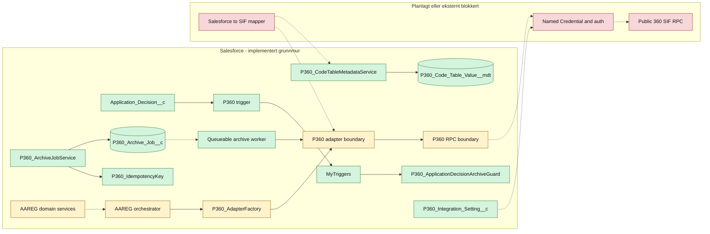
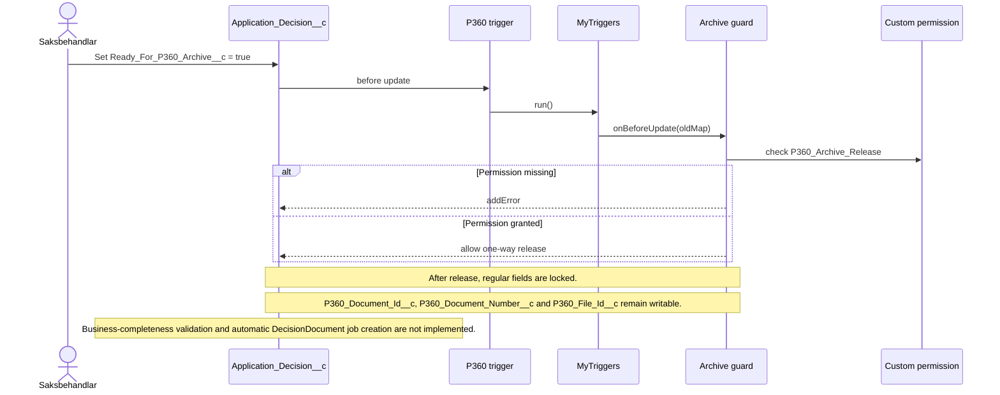
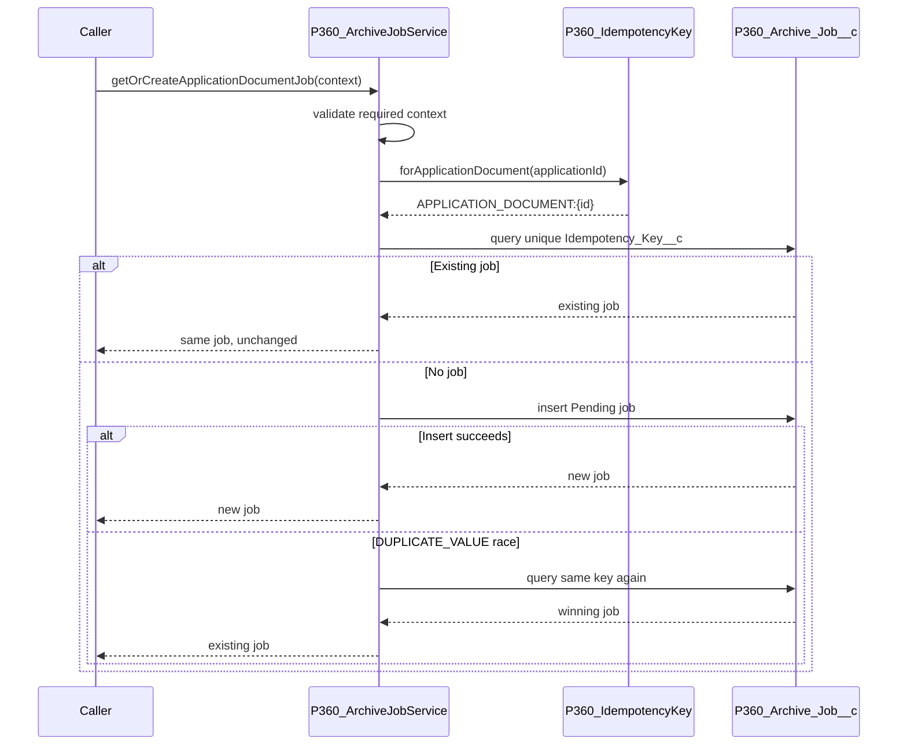
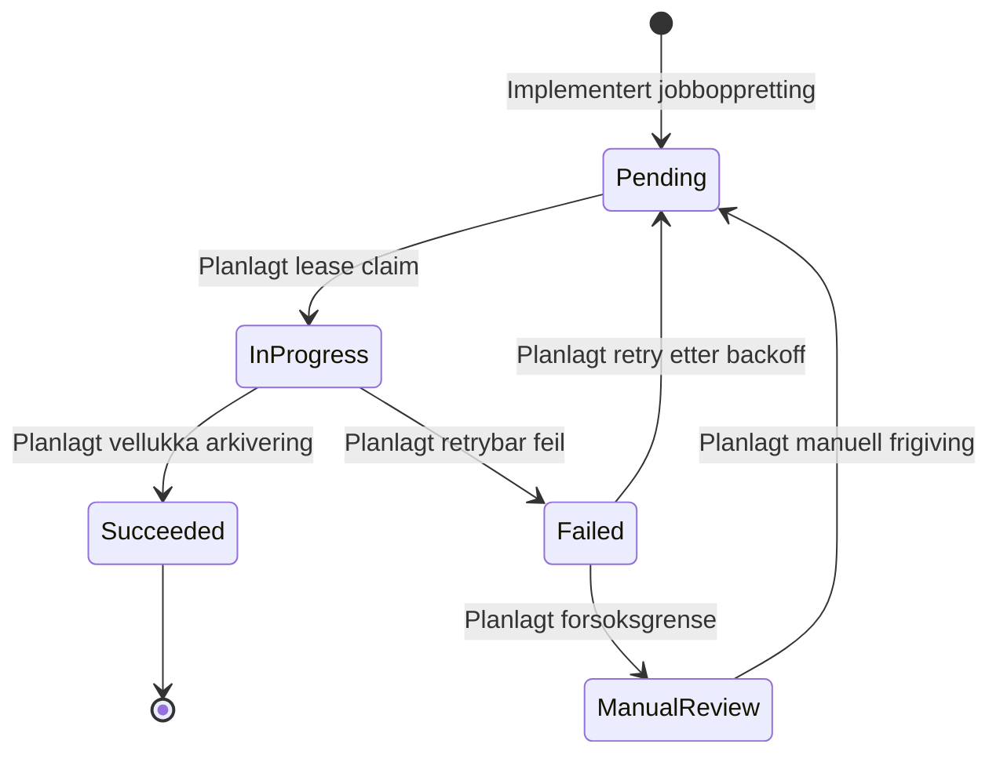

# P360 teknisk oversikt

Denne sida forklarer kva P360-integrasjonen i Salesforce består av per 2026-09-12, korleis dei implementerte delane verkar, og kvar grensene mot framtidig arbeid går.

## Statusnøklar

| Status                | Tyding                                                                                          |
| --------------------- | ----------------------------------------------------------------------------------------------- |
| Implementert og testa | Kode og metadata finst, og relevant Apex-test er køyrd i `crm-arbeidsforhold`.                  |
| Implementert kontrakt | Intern grense eller DTO er implementert og testa, men produksjonsflyten bak grensa finst ikkje. |
| Planlagt              | Arkitekturen er dokumentert, men produksjonskode manglar.                                       |
| Eksternt blokkert     | Krev stadfesta P360/SIF-kontrakt, autentisering, miljøverdiar eller mapping.                    |

## Status i korte trekk

Implementert og testa:

- operation-spesifikke DTO-ar for dokumenterte delar av Case-, Document- og File-kontraktane
- adapter-, RPC-, domene- og orkestreringsgrenser som stoppar kontrollert før uavklart transport
- constructor injection gjennom `P360_AdapterFactory`
- felles korrelasjonskontekst og test builders
- P360 exception-hierarki
- P360-referansefelt og `P360_Archive_Job__c`
- frigivingssignal og låsing av `Application_Decision__c` gjennom MyTriggers
- eigne permission sets for frigiving og jobbprosessering
- deterministiske idempotensnøklar for fire arkivhendingar
- idempotent oppretting av `ApplicationDocument`-jobbar
- Apex-testsuiten `P360` med alle P360-testklassane
- Custom Metadata Type `P360_Code_Table_Value__mdt` med godkjende, ikkje-sensitive standardrecordar (lookup-nøkkel `Default`) og `P360_CodeTableMetadataService` for kodeverksoppslag med per-transaksjon-cache
- første mock-baserte CreateCase-mapping via `AAREG_ApplicationToP360CaseMapper`, med metadataoppslag for standard value set, status, type, tilgang og ClassCode 1
- miljøstyrt konfigurasjonslag for `#1017`: Custom Setting `P360_Integration_Setting__c` for kva Named Credential som skal brukast, pluss Permission Set-ar (`P360_RPC_Callout_Access`, `P360_Code_Table_Access`) samla i Permission Set Group `P360_Integration_User`
- eksplisitt mock-transport for scratch orgar og sandkasser via `P360_Integration_Setting__c.Use_Mock_Transport__c`; når feltet er `true`, brukar `P360_AdapterFactory` `P360_StubArchiveAdapter`, medan ekte transport framleis er standard når feltet er `false` eller ikkje sett
- R2 worker-grunnmur: `P360_ArchiveJobClaimService` for lease/claim og `P360_ArchiveJobWorker` for statusklassifisering, retry-backoff og manuell oppfølging
- eksterne P360-ID-felt for lagring (`Access_Request__c.P360_Case_Id__c`/`P360_Case_Number__c`, `P360_Document_Id__c`/`P360_Document_Number__c`/`P360_File_Id__c` på `Application__c`/`Application_Decision__c`/`Agreement__c`)

Ikkje implementert:

- reelt SIF RPC-kall
- Named Credential, autentisering og miljøkonfigurasjon
- endeleg Salesforce-til-P360-mapping og kodeverk
- full orkestreringsflyt frå domeneobjekt til P360
- automatisk `DecisionDocument`-jobb ved frigiving
- vedleggsjobb og filopplasting
- scheduler som automatisk kallar queueable worker
- integrasjonstest mot P360-miljø

## Lag og ansvar

Diagramkjelde: [P360 current architecture](diagrams/p360-current-architecture.mmd)

Den heiltrukne delen viser kode som finst. Stipla overgangar viser planlagde eller blokkerte koplingar. Diagrammet skal ikkje lesast som at ein ende-til-ende arkivflyt allereie køyrer.

## Frigiving og låsing av vedtak

`Ready_For_P360_Archive__c` er eit einvegs forretningssignal. Triggeren inneheld ikkje forretningslogikk; han delegerer til MyTriggers, som finn `P360_ArchiveGuardHandler` gjennom `MyTriggerSetting__mdt`.

Begge triggerregistreringane har `IsBypassAllowed__c = false`. Frigivings- og låsekontrollen kan derfor ikkje koplast ut gjennom den generelle MyTriggers bypass-permissionen.

Diagramkjelde: [P360 decision release sequence](diagrams/p360-decision-release-sequence.mmd)

Permission-modellen er todelt:

- `AAREG_Arbeidsforhold_Saksbehandling` gir ordinær tilgang til feltet.
- `P360_Archive_Release` gir custom permission som sjølve guarden kontrollerer.

Dermed blir manglande frigivingsrett handtert av domeneregelen, ikkje som ein tilfeldig FLS-feil.

## Idempotensnøklar

`P360_IdempotencyKey` byggjer stabile interne nøklar:

| Hending         | Format                                                      |
| --------------- | ----------------------------------------------------------- |
| Søknadsdokument | `APPLICATION_DOCUMENT:{ApplicationId}`                      |
| Søknadsvedlegg  | `APPLICATION_ATTACHMENT:{ApplicationId}:{ContentVersionId}` |
| Vedtaksdokument | `DECISION_DOCUMENT:{ApplicationDecisionId}`                 |
| Avtaledokument  | `AGREEMENT_DOCUMENT:{AgreementId}`                          |

Manglande ID-ar gir `P360_ContractException`. Nøklane identifiserer Salesforce-arkivhendinga; dei definerer ikkje P360 si eksterne duplicate- eller recovery-åtferd.

## Idempotent jobboppretting

Berre `ApplicationDocument` er kopla til jobbservice no.

Diagramkjelde: [P360 idempotent archive job creation](diagrams/p360-idempotent-job-creation-sequence.mmd)

Ein ny jobb får:

- `Access_Request__c`
- `Application__c`
- `Archive_Event_Type__c = ApplicationDocument`
- `Status__c = Pending`
- `Attempt_Count__c = 0`
- første korrelasjons-ID
- køtid
- unik idempotensnøkkel

Retry med same nøkkel returnerer den eksisterande jobben og overskriv ikkje status eller opphavleg korrelasjonskontekst.

## Jobbstatus og framtidig worker

Diagramkjelde: [P360 archive job state model](diagrams/p360-archive-job-state.mmd)

Berre overgangen til `Pending` er implementert. Dei andre statusane finst i metadata og dokumentert design, men har ingen worker eller statusservice enno.

## Sikkerheit

- `P360_Archive_Release` avgrensar kven som kan frigive vedtak.
- `P360_Archive_Job_Processing` gir minste nødvendige objekt- og felttilgang for jobboppretting i den noverande slicen.
- Dei tre tekniske vedtaksreferansane er berre gitt gjennom processing-settet; release-settet gir custom permission og frigivingsfeltet, men ingen ekstra objekt-C/R/U.
- Permission-set-tildeling i testar blir gjort som setup-DML i ein separat `System.runAs`-grense for å unngå `MIXED_DML_OPERATION`.
- Domene- og jobb-DML blir køyrd som den aktuelle testbrukaren.
- Ingen secrets, AuthKey, token eller miljø-URL ligg i source.

### Maskering av sensitive felt i logging

`IntegrationLogRedactor` (`force-app/integration/common/classes/`) fjernar feltverdiar før dei kan hamne i teknisk logging. Ein felt-nøkkel blir rekna som sensitiv når nøkkelen inneheld (utan omsyn til store/små bokstavar) eitt av: `token`, `password`, `secret`, `authorization`, `cookie`, `fnr`, `ssn`, `personnummer`. Verdien blir då erstatta med `[REDACTED]`; nøkkelen og alle ikkje-sensitive verdiar er uendra. Input-mapen blir aldri mutert.

`IntegrationLogContext` held berre tekniske felt (systemnamn, operasjonsnamn, correlation-ID og status) og har ingen felt for nyttelast eller dokumentinnhald, slik at desse aldri kan hamne i loggkonteksten i utgangspunktet.

`P360_IntegrationException` kan bere ein correlation-ID vidare gjennom eit `catch`-grense via `withCorrelationId(...)`, verifisert av `P360_IntegrationExceptionCorrelationTest`. Dette gjer det mogleg å korrelere ein feil tilbake til det opphavlege loggkonteksten utan å logge nyttelast.

`IntegrationLogger` (`force-app/integration/common/classes/`) byggjer eit redigert loggpayload frå `IntegrationLogContext` og `IntegrationLogRedactor`, og persisterer det som `Application_Log__c` via den etablerte `LoggerUtility`/`Application_Event__e`-platform-event-pipelinen frå `crm-platform-base`. `Category__c` blir sett til systemnamnet (t.d. `P360`), og `Application_Domain__c` blir sett til den eksisterande `AAREG`-verdien, sidan det ikkje finst ein P360-spesifikk verdi i det delte, pakke-eigde verdisettet. Correlation-ID og andre tekniske felt blir serialiserte inn i `Pay_Load__c`; det finst ikkje eit dedikert correlation-ID-felt på `Application_Log__c`, og `Referrence_ID__c` (18 teikn) er for kort for ein 32-teikns correlation-ID.

Deploy `0AfQI00000jKxV30AK` mot `crm-arbeidsforhold`: `IntegrationLogRedactor` har 100 % dekning, 2/2 fokuserte testar bestått. Deploy `0AfQI00000jKxmn0AC`: `P360_IntegrationExceptionCorrelationTest` og eksisterande `P360_ExceptionHierarchyTest`, 4/4 testar bestått. Deploy `0AfQI00000jKyB40AK`: `IntegrationLoggerTest`, 4/4 testar bestått, inkludert verifisert `Application_Log__c`-persistens og at eit `authorization`-felt blir redigert før det når `Pay_Load__c`.

Permission set-et for jobbprosessering gir no felt-tilgang for claim/lease og retry-status på den implementerte workeren. Nye jobbtypar og worker-felt krev eksplisitt utviding og sikkerheitsgjennomgang.

## Kontraktgrensa mot P360

DTO-ane er baserte på den tilgjengelege SIF PDF-dokumentasjonen. Dei er interne, testbare kontraktar og ikkje bevis på at wire-formatet fungerer mot eit konkret miljø.

Følgjande klassar stoppar med kontrollerte exceptions i staden for å gjette:

- `AAREG_ApplicationDomainService`
- `AAREG_AgreementDomainService`
- `AAREG_ArchiveApplicationOrchestrator`
- `P360_ArchiveAdapter`
- `P360_RpcClient`

Før desse grensene kan opnast må Team P360 stadfeste endpoint, autentisering, envelope, mapping, kodeverk, feilmodell og duplicate/recovery-semantikk.

## Testing og verifikasjon

`force-app/tests/testSuites/P360.testSuite-meta.xml` er den autoritative P360-testsuiten. Han skal innehalde nøyaktig alle `*Test.cls` under `force-app/tests/classes/integration/p360`.

Siste verifiserte jobb- og idempotensslice:

| Kontroll                 | Resultat                                |
| ------------------------ | --------------------------------------- |
| Deploy                   | `0AfRR00000g2PtN0AU`, 27/27 komponentar |
| Testar i deploy          | 4/4 bestod                              |
| Separat test run         | `707RR00001XtOIQ`, 4/4 bestod           |
| `P360_ArchiveJobService` | 84 prosent dekning                      |
| `P360_IdempotencyKey`    | 100 prosent dekning                     |

Siste release-guard dry-run: `0AfRR00000g2QhN0AU`, 11/11 komponentar og 5/5 testar.

Tidlegare specs inneheld eigne historiske deploy- og test-ID-ar. Desse dokumenterer den avgrensa slicen, ikkje dagens samla P360-suite.

## Opne avgjerder

Seks tidlegare opne punkt (`#994`, `#993`, `#1017`, `#1016`, `#1018`, `#1015`) er kategoriserte etter kven som faktisk kan avgjere dei:

| Punkt     | Tema                                                     | Kven avgjer              | Status                                                                                                                                                  |
| --------- | -------------------------------------------------------- | ------------------------ | ------------------------------------------------------------------------------------------------------------------------------------------------------- |
| `#994`    | Feil klassenamn i Jira-tekst (før namnestandarden fanst) | Internt (Jira-tekst)     | **Avgjort.** Behald `P360_`-prefiks med understrek, i tråd med eksisterande kode og ADR-0001. Jira-teksten sjølv må rettast eksternt, ikkje gjort enno. |
| `#993`    | Exception-hierarki og retrybarheit                       | Internt (arkitektur)     | **Avgjort og implementert** (sjå under).                                                                                                                |
| `#996`/K3 | Service locator vs. adapter factory                      | Internt (arkitektur)     | **Avgjort.** `P360_AdapterFactory` + constructor injection, ingen service locator. Sjå [dependency injection og adapterval](di-og-adapterval.md).       |
| `#1017`   | RPC-miljø, endepunkt, auth-modell                        | P360-teamet              | Konfigurasjonslag bygd internt (sjå under). Endepunkt, auth-headerverdiar og secrets krev framleis ekstern stadfesting.                                 |
| `#1016`   | Salesforce→SIF-mapping, kodeverdiar                      | P360-teamet/fagsida      | Krev ekstern stadfesting. Kodeverk-strukturen (`P360_Code_Table_Value__mdt`) er klar til å ta imot verdiane.                                            |
| `#1018`   | Filstrategi (inline vs opplasting, PDF/A)                | P360-teamet/produkteigar | Krev ekstern stadfesting. "Alternativ 3" (P360 eig PDF/A) er valt internt.                                                                              |
| `#1015`   | Idempotens/retry-detaljar (feilkodar, rate limits)       | P360-teamet              | MVP implementert internt; retry-semantikk og feilkodeklassifisering krev ekstern stadfesting.                                                           |

### `#993` — retrybarheit i exception-modellen (avgjort 2026-09)

Retrybarheit blir no uttrykt fleksibelt, ikkje berre gjennom klassehierarkiet:

- `P360_IntegrationException.isRetryable` er ein `Boolean`-eigenskap (default `false`) sett via den flytande metoden `withRetryable(Boolean)`, same mønster som `withCorrelationId`.
- Klassifiseringa skjer av kallaren (t.d. basert på HTTP-statuskode eller P360-feilkode), ikkje berre av exception-typen — dette matchar gjeldande Apex-praksis for callout-feilhandtering.
- `P360_RetryableException` er behalde som eit bekvemt spesialtilfelle: han set `isRetryable = true` automatisk via ein instance-initializer-blokk, så eksisterande kode som kastar han treng ikkje endrast.
- Verifisert: deploy `0AfQI00000jKzv30AC`, 7/7 testar (`P360_IntegrationExceptionRetryableTest`, `P360_ExceptionHierarchyTest`, `P360_IntegrationExceptionCorrelationTest`).

### Konfigurasjonslag bygd for `#1017`

Sjølve endepunkt-URL, autentiseringsverdiar og secrets er ikkje bygd inn i repoet (krev ekstern stadfesting og skal aldri liggje i Git). Det som derimot er bygd, basert på eit eksisterande sibling-oppsett (`NKS P360 Integration`) som allereie brukar OAuth 2.0 Client Credentials mot Entra ID via External Credential:

- Hierarchy Custom Setting `P360_Integration_Setting__c` (felt `Named_Credential_Name__c`) held det miljøstyrte oppslaget for kva Named Credential Apex skal bruke. Verdien er data, ikkje metadata, og blir difor ikkje overskriven av ein vanleg deploy.
- Permission Set `P360_RPC_Callout_Access` gir tilgang til Custom Setting og `P360_RpcClient`. External Credential Principal-tilgang må leggjast til manuelt i kvart target-org etter at Named Credential/External Credential er oppretta der.
- Permission Set Group `P360_Integration_User` samlar `P360_RPC_Callout_Access`, `P360_Archive_Job_Processing` og `P360_Code_Table_Access`. Tildeling av gruppa til ein brukar er data og blir gjort separat per miljø (prod/sit2), slik at eit vanleg deploy ikkje overskriv kven som har integrasjonstilgang.

### Mock-modus for scratch orgar og sandkasser

`P360_Integration_Setting__c.Use_Mock_Transport__c` er ein eksplisitt org-innstilling for miljø utan live P360-integrasjon. Når han er `true`, vel `P360_AdapterFactory` `P360_StubArchiveAdapter`, slik at arkiveringsflyten kan køyrast ende-til-ende lokalt utan callout. Standardverdien er `false`; det finst ingen skjult fallback til mock dersom ekte transport feilar. Produksjonsmiljø skal la feltet vere `false`.

### Draftforslag til P360-teamet (`#1017`)

Kjelde: Salesforce Help stadfestar at "extensible, customizable" Named Credentials (introdusert Winter '23) er den sterkt anbefalte tilnærminga, og at gamle ("legacy") Named Credentials ikkje lenger blir oppdaterte. Forslag til P360-teamet bør difor be om:

1. Kva autentiseringsprotokoll P360 sitt RPC-endepunkt støttar (OAuth 2.0 Client Credentials føretrekt om tilgjengeleg, elles API-nøkkel/sertifikat via ekstern legitimasjon).
2. Test- og produksjonsendepunkt-URL-ar.
3. Nøyaktige operasjonsnamn/kontraktar for kvar av dei fire arkivhendingane.
4. Feilkodemodell (for `#1015`/`#1016`s retryklassifisering og mapping).

Dette bør implementerast som ein _external credential + named credential_ (ikkje legacy named credential) når kontrakten er stadfesta.

## Vidare arbeid

Rekkjefølgja bør vere:

1. Opprett idempotente `ApplicationAttachment`-jobbar per `ContentVersion__c`.
2. Opprett `DecisionDocument`-jobb etter godkjend frigivings- og komplettheitsvalidering.
3. Opprett `AgreementDocument`-jobb.
4. Implementer worker med lease og eksplisitte statusovergangar.
5. Implementer retryklassifisering og manuell oppfølging.
6. Stadfest SIF-kontrakt, mapping, auth og miljøoppsett.
7. Implementer adapter/RPC-transport og integrasjonstest mot P360-testmiljø.

## Relaterte dokument

- [P360 datamodell og arkiveringsjobb](../../architecture/p360-data-model-og-arkiveringsjob.md)
- [SIF API-kontraktar](sif-api-kontrakter.md)
- [SIF RPC-kontraktsoppslag](sif-rpc-kontrakt-oppslag.md)
- [Dependency injection og adapterval](di-og-adapterval.md)
- [Lokal implementasjonsstatus mot Jira](../../context/p360/lokal-implementasjonsstatus.md)
