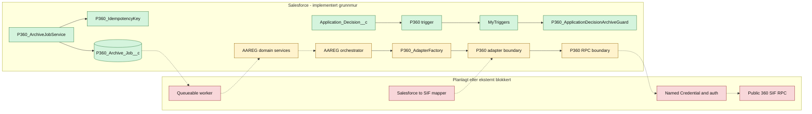
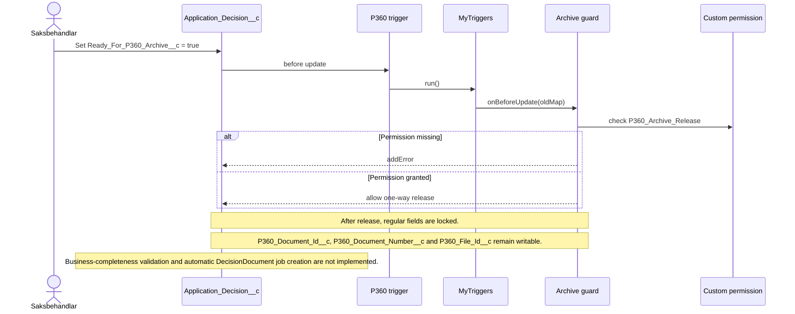
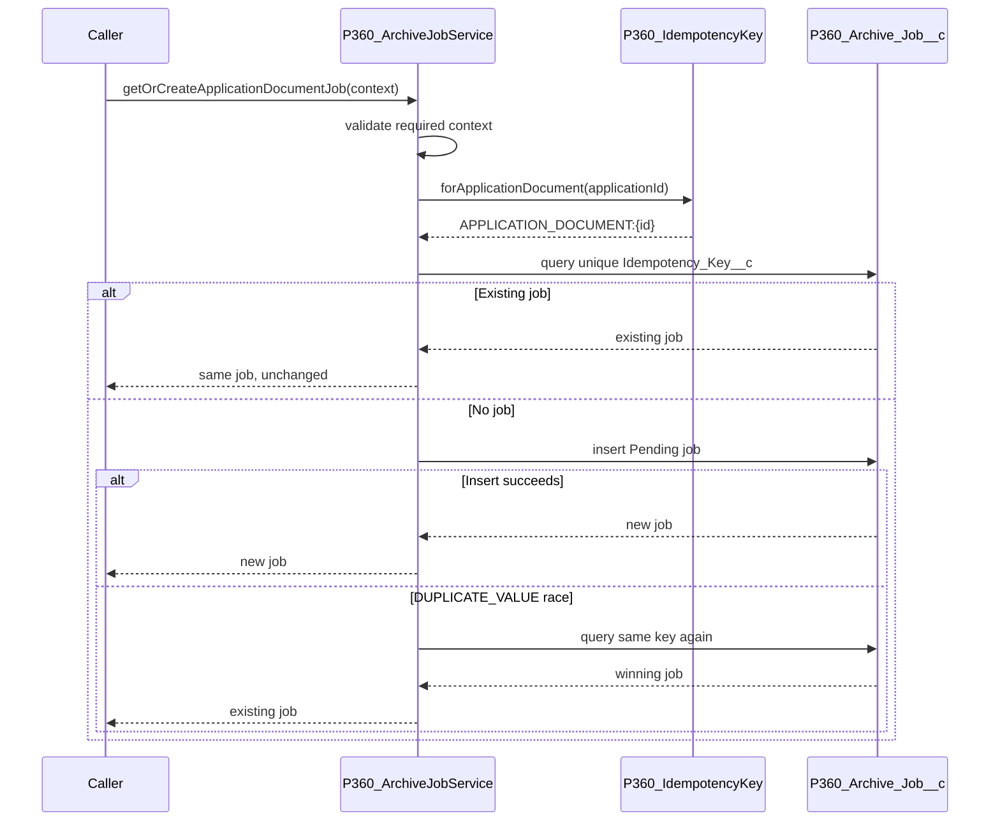
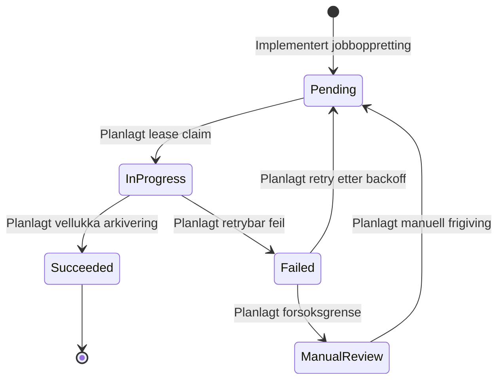

# P360 teknisk oversikt

Denne sida forklarer kva P360-integrasjonen i Salesforce består av per 2026-09-12, korleis dei implementerte delane verkar, og kvar grensene mot framtidig arbeid går.

## Statusnøklar

| Status                | Tyding                                                                                          |
| --------------------- | ----------------------------------------------------------------------------------------------- |
| Implementert og testa | Kode og metadata finst, og relevant Apex-test er køyrd i `crm-arbeidsforhold`.                  |
| Implementert kontrakt | Intern grense eller DTO er implementert og testa, men produksjonsflyten bak grensa finst ikkje. |
| Planlagt              | Arkitekturen er dokumentert, men produksjonskode manglar.                                       |
| Eksternt blokkert     | Krev stadfesta P360/SIF-kontrakt, autentisering, miljøverdiar eller mapping.                    |

## Status i korte trekk

Implementert og testa:

- operation-spesifikke DTO-ar for dokumenterte delar av Case-, Document- og File-kontraktane
- adapter-, RPC-, domene- og orkestreringsgrenser som stoppar kontrollert før uavklart transport
- constructor injection gjennom `P360_AdapterFactory`
- felles korrelasjonskontekst og test builders
- P360 exception-hierarki
- P360-referansefelt og `P360_Archive_Job__c`
- frigivingssignal og låsing av `Application_Decision__c` gjennom MyTriggers
- eigne permission sets for frigiving og jobbprosessering
- deterministiske idempotensnøklar for fire arkivhendingar
- idempotent oppretting av `ApplicationDocument`-jobbar
- Apex-testsuiten `P360` med alle P360-testklassane

Ikkje implementert:

- reelt SIF RPC-kall
- Named Credential, autentisering og miljøkonfigurasjon
- endeleg Salesforce-til-P360-mapping og kodeverk
- full orkestreringsflyt frå domeneobjekt til P360
- automatisk `DecisionDocument`-jobb ved frigiving
- vedleggsjobb og filopplasting
- queueable worker, lease, retry og manuell frigiving
- integrasjonstest mot P360-miljø

## Lag og ansvar

Diagramkjelde: [P360 current architecture](diagrams/p360-current-architecture.mmd)

Den heiltrukne delen viser kode som finst. Stipla overgangar viser planlagde eller blokkerte koplingar. Diagrammet skal ikkje lesast som at ein ende-til-ende arkivflyt allereie køyrer.

## Frigiving og låsing av vedtak

`Ready_For_P360_Archive__c` er eit einvegs forretningssignal. Triggeren inneheld ikkje forretningslogikk; han delegerer til MyTriggers, som finn `P360_ArchiveGuardHandler` gjennom `MyTriggerSetting__mdt`.

Begge triggerregistreringane har `IsBypassAllowed__c = false`. Frigivings- og låsekontrollen kan derfor ikkje koplast ut gjennom den generelle MyTriggers bypass-permissionen.

Diagramkjelde: [P360 decision release sequence](diagrams/p360-decision-release-sequence.mmd)

Permission-modellen er todelt:

- `AAREG_Arbeidsforhold_Saksbehandling` gir ordinær tilgang til feltet.
- `P360_Archive_Release` gir custom permission som sjølve guarden kontrollerer.

Dermed blir manglande frigivingsrett handtert av domeneregelen, ikkje som ein tilfeldig FLS-feil.

## Idempotensnøklar

`P360_IdempotencyKey` byggjer stabile interne nøklar:

| Hending         | Format                                                      |
| --------------- | ----------------------------------------------------------- |
| Søknadsdokument | `APPLICATION_DOCUMENT:{ApplicationId}`                      |
| Søknadsvedlegg  | `APPLICATION_ATTACHMENT:{ApplicationId}:{ContentVersionId}` |
| Vedtaksdokument | `DECISION_DOCUMENT:{ApplicationDecisionId}`                 |
| Avtaledokument  | `AGREEMENT_DOCUMENT:{AgreementId}`                          |

Manglande ID-ar gir `P360_ContractException`. Nøklane identifiserer Salesforce-arkivhendinga; dei definerer ikkje P360 si eksterne duplicate- eller recovery-åtferd.

## Idempotent jobboppretting

Berre `ApplicationDocument` er kopla til jobbservice no.

Diagramkjelde: [P360 idempotent archive job creation](diagrams/p360-idempotent-job-creation-sequence.mmd)

Ein ny jobb får:

- `Access_Request__c`
- `Application__c`
- `Archive_Event_Type__c = ApplicationDocument`
- `Status__c = Pending`
- `Attempt_Count__c = 0`
- første korrelasjons-ID
- køtid
- unik idempotensnøkkel

Retry med same nøkkel returnerer den eksisterande jobben og overskriv ikkje status eller opphavleg korrelasjonskontekst.

## Jobbstatus og framtidig worker

Diagramkjelde: [P360 archive job state model](diagrams/p360-archive-job-state.mmd)

Berre overgangen til `Pending` er implementert. Dei andre statusane finst i metadata og dokumentert design, men har ingen worker eller statusservice enno.

## Sikkerheit

- `P360_Archive_Release` avgrensar kven som kan frigive vedtak.
- `P360_Archive_Job_Processing` gir minste nødvendige objekt- og felttilgang for jobboppretting i den noverande slicen.
- Dei tre tekniske vedtaksreferansane er berre gitt gjennom processing-settet; release-settet gir custom permission og frigivingsfeltet, men ingen ekstra objekt-C/R/U.
- Permission-set-tildeling i testar blir gjort som setup-DML i ein separat `System.runAs`-grense for å unngå `MIXED_DML_OPERATION`.
- Domene- og jobb-DML blir køyrd som den aktuelle testbrukaren.
- Ingen secrets, AuthKey, token eller miljø-URL ligg i source.

Permission set-et for jobbprosessering er ikkje eit ferdig driftssett for den framtidige workeren. Nye jobbtypar og worker-felt krev eksplisitt utviding og sikkerheitsgjennomgang.

## Kontraktgrensa mot P360

DTO-ane er baserte på den tilgjengelege SIF PDF-dokumentasjonen. Dei er interne, testbare kontraktar og ikkje bevis på at wire-formatet fungerer mot eit konkret miljø.

Følgjande klassar stoppar med kontrollerte exceptions i staden for å gjette:

- `AAREG_ApplicationDomainService`
- `AAREG_AgreementDomainService`
- `AAREG_ArchiveApplicationOrchestrator`
- `P360_ArchiveAdapter`
- `P360_RpcClient`

Før desse grensene kan opnast må Team P360 stadfeste endpoint, autentisering, envelope, mapping, kodeverk, feilmodell og duplicate/recovery-semantikk.

## Testing og verifikasjon

`force-app/tests/testSuites/P360.testSuite-meta.xml` er den autoritative P360-testsuiten. Han skal innehalde nøyaktig alle `*Test.cls` under `force-app/tests/classes/integration/p360`.

Siste verifiserte jobb- og idempotensslice:

| Kontroll                 | Resultat                                |
| ------------------------ | --------------------------------------- |
| Deploy                   | `0AfRR00000g2PtN0AU`, 27/27 komponentar |
| Testar i deploy          | 4/4 bestod                              |
| Separat test run         | `707RR00001XtOIQ`, 4/4 bestod           |
| `P360_ArchiveJobService` | 84 prosent dekning                      |
| `P360_IdempotencyKey`    | 100 prosent dekning                     |

Siste release-guard dry-run: `0AfRR00000g2QhN0AU`, 11/11 komponentar og 5/5 testar.

Tidlegare specs inneheld eigne historiske deploy- og test-ID-ar. Desse dokumenterer den avgrensa slicen, ikkje dagens samla P360-suite.

## Vidare arbeid

Rekkjefølgja bør vere:

1. Opprett idempotente `ApplicationAttachment`-jobbar per `ContentVersion__c`.
2. Opprett `DecisionDocument`-jobb etter godkjend frigivings- og komplettheitsvalidering.
3. Opprett `AgreementDocument`-jobb.
4. Implementer worker med lease og eksplisitte statusovergangar.
5. Implementer retryklassifisering og manuell oppfølging.
6. Stadfest SIF-kontrakt, mapping, auth og miljøoppsett.
7. Implementer adapter/RPC-transport og integrasjonstest mot P360-testmiljø.

## Relaterte dokument

- [P360 datamodell og arkiveringsjobb](../../architecture/p360-data-model-og-arkiveringsjob.md)
- [SIF API-kontraktar](sif-api-kontrakter.md)
- [SIF RPC-kontraktsoppslag](sif-rpc-kontrakt-oppslag.md)
- [Dependency injection og adapterval](di-og-adapterval.md)
- [Lokal implementasjonsstatus mot Jira](../../context/p360/lokal-implementasjonsstatus.md)
