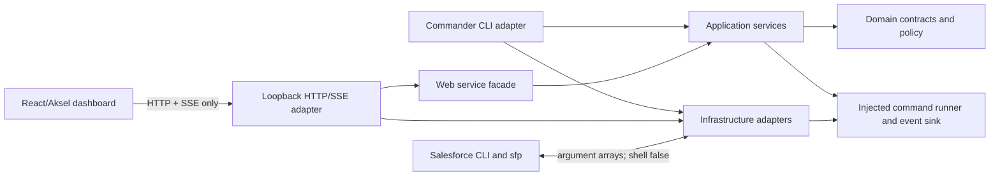

# Architecture

`@navikt/salesforce-project-cli` is a CLI-first Node.js 22 application. The command-line adapter and the loopback web adapter share the same application services and domain contracts. The React dashboard is built separately and communicates with the core only through HTTP and Server-Sent Events (SSE).

The accepted decision and alternatives are recorded in [ADR-0001](adr/0001-cli-first-shared-application-core.md). Migration scope is tracked in the [legacy behaviour matrix](legacy-behavior-matrix.md).

## Module map

```text
src/
  cli.ts                         process entry point
  cli-app.ts                     Commander adapter and output wiring
  index.ts                       embeddable public exports
  domain/                        stable data, policy, and event contracts
  application/                   workflows and orchestration
  infrastructure/                command execution, rendering, redaction, error mapping
  web/server.ts                  authenticated loopback HTTP/SSE adapter
web/
  src/api.ts                     browser transport adapter
  src/App.tsx                    dashboard state and presentation
  src/styles.css                 responsive layout
  e2e/                           fake server and browser contracts
test/
  unit/                          isolated domain/infrastructure/application tests
  contract/                      CLI and server behavior through injected fakes
```

## Dependency direction



Dependencies point inward. Domain modules do not import adapters. Application services accept command runners and event sinks, which lets tests use deterministic fakes. The web server depends on a `WebServiceFacade`; its production implementation delegates to the same application services as the CLI. React and Aksel are build-time frontend concerns and are not imported by the reusable core.

## Layer responsibilities

| Layer           | Responsibilities                                                                                               | Must not own                                     |
| --------------- | -------------------------------------------------------------------------------------------------------------- | ------------------------------------------------ |
| Domain          | Configuration normalization, package version comparison, org mutation policy, stable events and exit codes     | Process I/O, HTTP, React, or child processes     |
| Application     | Package, org, dependency, doctor, and project workflows; ordering; partial-completion decisions                | Terminal formatting or HTTP parsing              |
| Infrastructure  | `execa` command execution, retry mechanics, redaction, Salesforce error classification, human/NDJSON rendering | Business workflow selection                      |
| CLI adapter     | Commander definitions, CLI precedence, output channels, lifecycle event envelopes                              | Duplicate workflow implementations               |
| Web adapter     | Loopback security, payload validation, policy preauthorization, operation retention, SSE, static assets        | Salesforce command details                       |
| Browser adapter | Authenticated fetch/SSE and dashboard state/presentation                                                       | Direct filesystem, process, or Salesforce access |

## Operation lifecycle

Every operation has a UUID, ISO timestamps, and a terminal `operation-completed` event. Application services emit intermediate events but the CLI or web adapter owns the outer lifecycle.


The event union includes:

- `operation-started` and `operation-completed`
- `step-started`, `progress`, `retrying`, `warning`, `step-completed`, and `step-failed`
- `package-result` and `package-summary`
- `org-summary`, `post-step-result`, and `workflow-summary`
- `doctor-check` and `doctor-summary`

Step IDs and parent IDs allow consumers to reconstruct hierarchy without parsing rendered text. The CLI renders these events for humans or emits NDJSON. The web server redacts, retains, replays, and broadcasts the same events.

Long-running steps (package install, org create/delete, project configure's post-steps, dependency retrieval) also emit a periodic, non-diagnostic `progress` heartbeat every 15 seconds while their command is in flight, via `withProgressHeartbeat` in `src/infrastructure/progress-heartbeat.ts`. This keeps non-verbose output from going silent during a slow command; it is a plain new event per tick, not a redrawn spinner, so it fits the existing line-based, testable output model unchanged. Each heartbeat event carries `heartbeat: true`; the web server's bounded, replayable operation history (`maxEventsPerOperation`) keeps only the latest tick per step instead of every tick, so a single slow step cannot crowd out earlier history. Live SSE subscribers still receive every tick as it happens — only retained/replay history is coalesced.

Package installation also reports its preflight phases before package results are available: target-org validation, initial installed-package lookup, and sequential released-version resolution (`[n/total]`). This makes the planning work visible in human output and NDJSON instead of leaving the operation at `packages.install` with no explanation while Salesforce CLI queries are running.

Package plan/install/update commands also support explicit `--mock` mode. The mock runner is injected at the command boundary and returns deterministic package/version/install-report fixtures without spawning Salesforce CLI. This is intentionally separate from `--dry-run`: dry-run may perform real read-only queries, while mock mode performs no external calls and marks the operation as simulated.

Application services keep orchestration separate from reusable execution seams:

- `package-plan-logic.ts` contains pure package status classification and summary calculation.
- `package-install-poller.ts` owns request-status polling and installed-state verification.
- `command-step-runner.ts` owns the shared org-workflow command lifecycle: output forwarding, heartbeat, retry, and failure events.
- `dependency-retrieval-runner.ts` owns one dependency retrieval command and its retry/heartbeat behavior.

These seams are injected and unit-tested independently; the existing application functions remain the public orchestration boundary.

Install mutations submit with `sf package install --wait 0` and poll the returned `0Hf` request through `sf package install report`. This avoids coupling completion detection to the Salesforce CLI process's built-in wait loop; the application owns the poll interval, total timeout, cancellation, and final status handling.

## Adapters and boundaries

### Command runner

External processes receive an executable and an argument array with `shell: false`. Output is decoded as UTF-8, streamed by line when requested, and captured in a normalized result. Cancellation, timeout, secret redaction, and bounded retry behavior all live at this boundary:

- **Timeout:** every invocation carries a `timeoutMs`, either set explicitly by the caller or applied by the `withDefaultTimeout` wrapper using `commandTimeouts.readMs`/`commandTimeouts.mutationMs` (overridable per invocation by the CLI's global `--timeout <seconds>`). A command that exceeds its timeout is terminated and reported as `timedOut: true` rather than hanging the process.
- **Retry:** a shared classifier, `isTransientCommandFailure`, recognizes transport signatures (`TypeError: terminated`, `ECONNRESET`, `socket hang up`, `ETIMEDOUT`, `ENOTFOUND`, `UND_ERR_`) and drives a bounded retry policy (three attempts, five-second delay) for mutating operations — package install, org create/delete, project configuration's post-steps, remote source-tracking reset, and dependency retrieval. Read-only inspection commands remain single-attempt.
- **Cancellation:** an `AbortSignal` optionally threaded into a request aborts the underlying process. The web server creates one `AbortController` per operation and aborts it when `POST /api/v1/operations/:id/cancel` targets a `running` operation; the same signal is forwarded through the mutating application services (`ConfigureProjectOptions`, `CreateOrgOptions`, `DeleteOrgOptions`, `PlanPackagesOptions`, `MutatePackagesOptions`, `RefreshDependenciesOptions`) down to every command they issue.

See [Timeout, retry, and cancellation flow](#timeout-retry-and-cancellation-flow) below for how these three behaviors compose around one command invocation.

### Salesforce boundary

The tool delegates platform behavior to the installed `sf` CLI. Pool operations use `sfp` only when configured. No Salesforce SDK is embedded, and local tests do not prove authenticated Salesforce compatibility.

### Web boundary

The server binds only to `127.0.0.1`. It authenticates private API and SSE requests with a per-process token, requires exact loopback `Host`, requires same-origin `Origin` for POST, and applies mutation policy before dispatch. See [Web API](web-api.md) and [Security](../SECURITY.md).

### Filesystem boundary

Dependency cleanup resolves real paths, rejects escapes and symbolic links, and rechecks roots around deletion. Dependency refresh temporarily removes `.forceignore` through a durable marker/backup transaction and restores it in `finally` and on interruption signals.

## Timeout, retry, and cancellation flow

This diagram shows how one mutating command invocation is bounded by a timeout, may be retried on a transient failure, and can be aborted mid-flight by a web cancellation request — the three behaviors compose at the same command-runner boundary rather than being three separate mechanisms.

```mermaid
flowchart TD
    Start([Application service builds a CommandRequest]) --> Timeout{timeoutMs set?}
    Timeout -->|no, wrapped by withDefaultTimeout| ApplyDefault[Apply commandTimeouts.readMs/mutationMs\nor --timeout override]
    Timeout -->|yes, explicit| Run
    ApplyDefault --> Run[runCommand executes sf/git via execa]
    Run --> Signal{AbortSignal aborted?\ne.g. web cancel endpoint}
    Signal -->|yes| Canceled[Process killed\ncanceled: true]
    Signal -->|no| Outcome{Command outcome}
    Outcome -->|success| Success[failed: false\nstep-completed event]
    Outcome -->|timed out| TimedOut[timedOut: true\nstep-failed: "did not respond in time"]
    Outcome -->|failed, transient signature,\nmutating op, attempts remain| Retry[retrying event\n5s delay, up to 3 attempts]
    Outcome -->|failed, not retryable\nor read-only op| Failed[step-failed with classified exit code]
    Retry --> Run
    Canceled --> CanceledEvent[step-failed: "Operation was canceled"\noperation-completed]

    classDef terminal fill:#d4f4dd,stroke:#2d7a3e,color:#111
    classDef failure fill:#f8d7da,stroke:#9b2c2c,color:#111
    classDef retrying fill:#fff3cd,stroke:#946200,color:#111
    class Success terminal
    class TimedOut,Failed,CanceledEvent failure
    class Retry retrying
```

## Design tradeoffs

- **CLI-first over web-first:** automation and recovery remain usable without a browser; the UI is an adapter, not a second command engine.
- **Salesforce CLI over an SDK:** platform behavior stays aligned with installed Salesforce tooling, at the cost of subprocess parsing and an authenticated compatibility gate.
- **Typed events over parsing text:** human output, NDJSON, tests, history, and SSE share one model; adding event fields requires compatibility care.
- **Sequential package and retrieve work:** preserves declared order and makes partial completion deterministic, at the cost of throughput.
- **Ephemeral local web state:** avoids storing operational or credential-bearing data, but history and live subscriptions disappear at process exit.
- **Frontend bundled separately:** packed users do not install React or Aksel as runtime dependencies, while maintainers carry a larger development dependency set.
- **Fail-closed filesystem and org policy:** ambiguous paths, interrupted transactions, and production/unknown org mutations are rejected, even when this requires manual recovery or an explicit dry run.
- **Legacy scripts remain available:** incomplete parity is visible rather than hidden behind unsafe forwarding.

## Known implementation limits

SSE has no heartbeat, event ID, resume cursor, or automatic reconnect. Stored events can be replayed after the frontend has already loaded them, and the frontend does not deduplicate them. Operation history is process-local. The server does not provide TLS or non-loopback binding. Cancellation targets the web API's mutating operations only — there is no CLI-side Ctrl+C/SIGINT cancellation contract, and read-only inspection calls (`org display`/`org list`/`org status`) are not cancellable. These are current constraints, not promised behavior.
