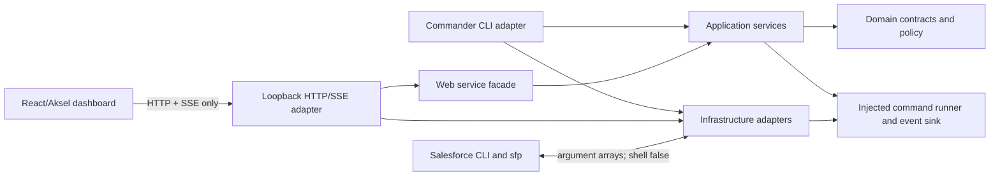
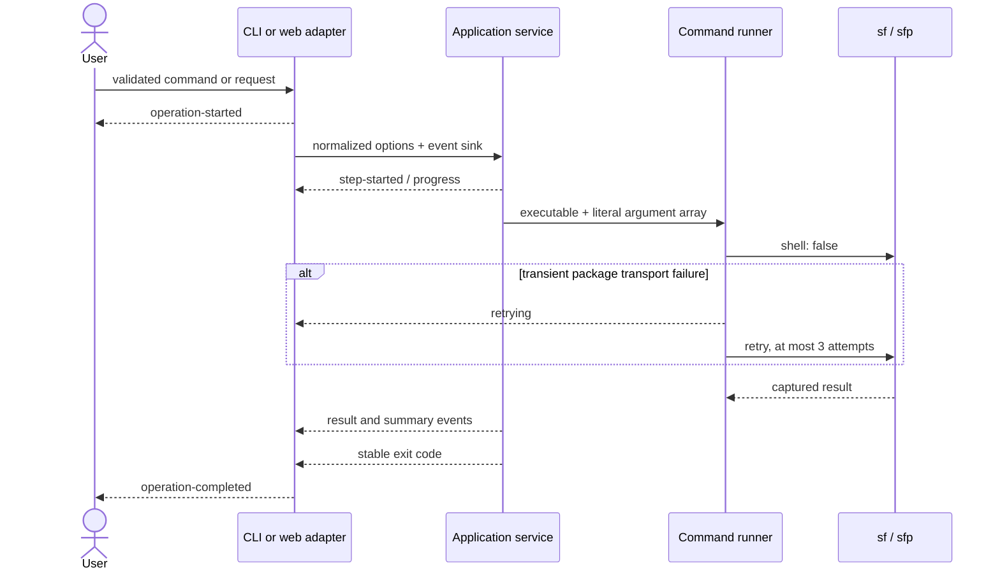

# Architecture

`@navikt/salesforce-project-cli` is a CLI-first Node.js 22 application. The command-line adapter and the loopback web adapter share the same application services and domain contracts. The React dashboard is built separately and communicates with the core only through HTTP and Server-Sent Events (SSE).

The accepted decision and alternatives are recorded in [ADR-0001](adr/0001-cli-first-shared-application-core.md). Migration scope is tracked in the [legacy behaviour matrix](legacy-behavior-matrix.md).

## Module map

```text
src/
  cli.ts                         process entry point
  cli-app.ts                     Commander adapter and output wiring
  index.ts                       embeddable public exports
  domain/                        stable data, policy, and event contracts
  application/                   workflows and orchestration
  infrastructure/                command execution, rendering, redaction, error mapping
  web/server.ts                  authenticated loopback HTTP/SSE adapter
web/
  src/api.ts                     browser transport adapter
  src/App.tsx                    dashboard state and presentation
  src/styles.css                 responsive layout
  e2e/                           fake server and browser contracts
test/
  unit/                          isolated domain/infrastructure/application tests
  contract/                      CLI and server behavior through injected fakes
```

## Dependency direction



Dependencies point inward. Domain modules do not import adapters. Application services accept command runners and event sinks, which lets tests use deterministic fakes. The web server depends on a `WebServiceFacade`; its production implementation delegates to the same application services as the CLI. React and Aksel are build-time frontend concerns and are not imported by the reusable core.

## Layer responsibilities

| Layer           | Responsibilities                                                                                               | Must not own                                     |
| --------------- | -------------------------------------------------------------------------------------------------------------- | ------------------------------------------------ |
| Domain          | Configuration normalization, package version comparison, org mutation policy, stable events and exit codes     | Process I/O, HTTP, React, or child processes     |
| Application     | Package, org, dependency, doctor, and project workflows; ordering; partial-completion decisions                | Terminal formatting or HTTP parsing              |
| Infrastructure  | `execa` command execution, retry mechanics, redaction, Salesforce error classification, human/NDJSON rendering | Business workflow selection                      |
| CLI adapter     | Commander definitions, CLI precedence, output channels, lifecycle event envelopes                              | Duplicate workflow implementations               |
| Web adapter     | Loopback security, payload validation, policy preauthorization, operation retention, SSE, static assets        | Salesforce command details                       |
| Browser adapter | Authenticated fetch/SSE and dashboard state/presentation                                                       | Direct filesystem, process, or Salesforce access |

## Operation lifecycle

Every operation has a UUID, ISO timestamps, and a terminal `operation-completed` event. Application services emit intermediate events but the CLI or web adapter owns the outer lifecycle.



The event union includes:

- `operation-started` and `operation-completed`
- `step-started`, `progress`, `retrying`, `warning`, `step-completed`, and `step-failed`
- `package-result` and `package-summary`
- `org-summary`, `post-step-result`, and `workflow-summary`
- `doctor-check` and `doctor-summary`

Step IDs and parent IDs allow consumers to reconstruct hierarchy without parsing rendered text. The CLI renders these events for humans or emits NDJSON. The web server redacts, retains, replays, and broadcasts the same events.

## Adapters and boundaries

### Command runner

External processes receive an executable and an argument array with `shell: false`. Output is decoded as UTF-8, streamed by line when requested, and captured in a normalized result. Optional cancellation, timeout, secret redaction, and bounded retry behavior live at this boundary. Package installation retries only recognized transient transport signatures.

### Salesforce boundary

The tool delegates platform behavior to the installed `sf` CLI. Pool operations use `sfp` only when configured. No Salesforce SDK is embedded, and local tests do not prove authenticated Salesforce compatibility.

### Web boundary

The server binds only to `127.0.0.1`. It authenticates private API and SSE requests with a per-process token, requires exact loopback `Host`, requires same-origin `Origin` for POST, and applies mutation policy before dispatch. See [Web API](web-api.md) and [Security](../SECURITY.md).

### Filesystem boundary

Dependency cleanup resolves real paths, rejects escapes and symbolic links, and rechecks roots around deletion. Dependency refresh temporarily removes `.forceignore` through a durable marker/backup transaction and restores it in `finally` and on interruption signals.

## Design tradeoffs

- **CLI-first over web-first:** automation and recovery remain usable without a browser; the UI is an adapter, not a second command engine.
- **Salesforce CLI over an SDK:** platform behavior stays aligned with installed Salesforce tooling, at the cost of subprocess parsing and an authenticated compatibility gate.
- **Typed events over parsing text:** human output, NDJSON, tests, history, and SSE share one model; adding event fields requires compatibility care.
- **Sequential package and retrieve work:** preserves declared order and makes partial completion deterministic, at the cost of throughput.
- **Ephemeral local web state:** avoids storing operational or credential-bearing data, but history and live subscriptions disappear at process exit.
- **Frontend bundled separately:** packed users do not install React or Aksel as runtime dependencies, while maintainers carry a larger development dependency set.
- **Fail-closed filesystem and org policy:** ambiguous paths, interrupted transactions, and production/unknown org mutations are rejected, even when this requires manual recovery or an explicit dry run.
- **Legacy scripts remain available:** incomplete parity is visible rather than hidden behind unsafe forwarding.

## Known implementation limits

The standard facade does not implement cancellation. SSE has no heartbeat, event ID, resume cursor, or automatic reconnect. Stored events can be replayed after the frontend has already loaded them, and the frontend does not deduplicate them. Operation history is process-local. The server does not provide TLS or non-loopback binding. These are current constraints, not promised behavior.
