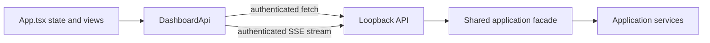

# Web frontend

The dashboard is a React 19 and Aksel 8.16.2 client built under `web/` and emitted to `web-dist/`. It is an operational view over the loopback API, not a second workflow implementation.

## Architecture and data flow

`DashboardApi` is injected into the application. Production uses `browserApi`; component tests provide fakes. The browser adapter reads the ephemeral token from the server-injected meta element and attaches it to every API and SSE request. It uses relative same-origin URLs and never persists the token.

On initial load, the application fetches the org list and recent operations concurrently. It selects the first returned org, not necessarily the org marked as default. Selecting an org fetches its detail and package status. Org-level and package-level loading/error states are separate.

Running operations receive replayed and live events through one abortable fetch stream. The UI appends incoming events. It does not currently deduplicate events that were present in initial history and then replayed by SSE, automatically reconnect, or expose cancellation.

## Dashboard views

### Org list and detail

The org table shows safe normalized values such as alias, type, authentication, connection, expiration, and default-org state. Unknown server values remain visibly unknown rather than being inferred. Selecting an org opens normalized details and capabilities without exposing its instance URL or credentials.

The first org in the API response becomes the initial selection. The frontend does not sort or prefer `isDefaultOrg` before selecting.

### Package status

For the selected org, the dashboard loads configured, installed, and selected package versions plus status counts. Statuses are current, update available, higher, missing, or unknown. A package-status failure is shown independently of the rest of the dashboard.

### Operations

Recent and active operations show command, lifecycle status, timestamps, exit code when available, and retained event messages. New operations are added from the returned operation ID and updated from SSE.

## Command form

The command form exposes these server operations:

- `packages.plan` (initial selection)
- `packages.install`
- `packages.update`
- `dependencies.clear`
- `dependencies.refresh`
- `org.create`
- `project.configure`

Org deletion is a separate destructive action and alert dialog.

The target-org field defaults visually to the selected org when the command uses a target. An empty target is omitted from the request, allowing configured/server defaults to apply. Package plan is always submitted as a dry run. Org creation submits a duration of 14 days and a real execution; other unexposed values use server and project configuration defaults.

The current UI does not expose:

- `doctor`
- org list/status/info as commands
- dependency recovery
- operation cancellation
- `installLatest`
- post-step selection
- pool settings
- create-time dependency clear/refresh flags

These remain CLI or API capabilities.

## Read-only policy

The server remains authoritative. The dashboard uses the selected org’s `mutationPolicy` to constrain forms and force dry-run behavior for explicitly selected read-only targets. Production and unknown orgs are presented as read-only. A user cannot turn confirmation or UI state into server authorization.

If a command omits its target, the server may resolve configured defaults independently. For operational clarity, select or enter a target explicitly before real mutation.

## Destructive confirmation

Deletion is not part of the generic command form. The UI opens an Aksel alert dialog that names the target org. Confirmation sends `org.delete` with the alias and `confirmed: true`; cancellation closes the dialog without starting an operation. The server then rechecks origin, bearer token, mutation policy, and payload confirmation, while the application service restricts actual deletion to scratch orgs.

## Accessibility

The implementation uses Aksel components and Norwegian Nynorsk translations. Current accessibility behavior includes:

- semantic tables with captions
- labeled inputs and controls
- focusable horizontally scrollable table regions
- live status announcements
- alert semantics for failures
- alert-dialog semantics for deletion confirmation
- component tests with `jest-axe`
- Playwright scans with `@axe-core/playwright`

Accessibility tests are guardrails, not a substitute for keyboard, screen-reader, zoom, and contrast review when the UI changes.

## Responsive behavior

The layout uses Aksel responsive grid primitives and module CSS. The command panel is sticky on desktop and returns to normal document flow on smaller viewports. Wide tables scroll horizontally instead of forcing viewport overflow. Browser coverage includes desktop Chrome and an iPhone 13 emulation project, with checks for viewport overflow and screenshots.

## Frontend errors and security

Non-success API responses become user-visible errors using the server’s redacted `error` field. Missing bootstrap token fails locally with the Nynorsk message for a missing secure local session. SSE failures are logged to the browser console unless the stream was intentionally aborted.

The dashboard must remain same-origin. It must not accept a token from user input, URL state, browser storage, or configuration. New controls should call `DashboardApi`, keep policy enforcement on the server, and avoid rendering raw command output or credential-bearing fields.
