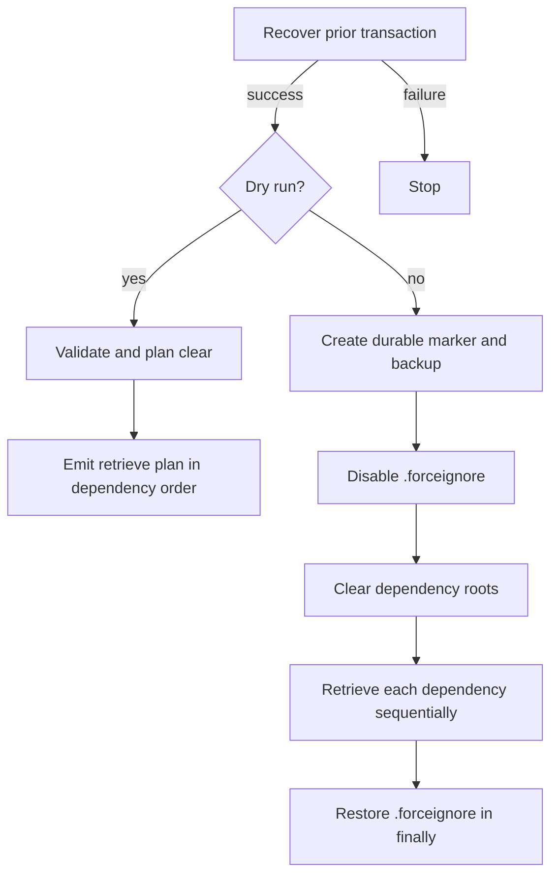

# Workflows

Application services compose small, ordered operations and return stable exit codes. Unless stated otherwise, a workflow stops at its first failed mutating stage. Use `--dry-run` to inspect supported plans before mutation.

## Dependency source clear

`dependencies clear` derives dependency source roots from `sfdx-project.json` and processes them in deduplicated dependency-name order.

1. Resolve the project and dependency root real paths.
2. Reject a root outside the project, a symbolic-link root, or a root whose real path escapes the project.
3. Skip a missing root.
4. Emit the root, package name, preserved entries, and dry-run state.
5. In a real run, enumerate root children other than configured preserved names.
6. Before each deletion, revalidate that the root has not changed.
7. Reject symbolic-link or escaping children; recursively remove validated children.

Dry-run validates each existing root and emits intent, but does not enumerate or delete its children. The operation does not prompt for confirmation.

## Dependency refresh

Every refresh first runs validated transaction recovery so a prior interrupted operation cannot be overwritten. A real refresh then disables `.forceignore`, clears sources, and invokes `sf project retrieve start` once per dependency source with `-n <package-name>`. An explicit target adds `--target-org`; otherwise Salesforce CLI target resolution applies.

Restoration occurs in `finally`, including after cleanup, retrieval, or event failures. The transaction also registers best-effort SIGINT and SIGTERM restoration. A first retrieve failure returns a classified failure. A failure after at least one successful retrieve falls back to partial completion (`5`) unless authentication classification is more specific.

## Dependency recovery

`dependencies recover` examines the durable marker and backup left by interrupted `.forceignore` handling. Recovery validates:

- canonical project identity
- marker and backup ownership and exclusive identity
- regular-file types rather than links or special files
- original byte length and SHA-256 checksum
- encoded original content
- absence of a conflicting active `.forceignore`

Ambiguity fails closed and leaves artifacts available for inspection. Recovery never overwrites an active `.forceignore`. Dry-run validates and reports the plan without restoring or removing transaction files.

## Package plan

The package planner:

1. Queries installed packages once for the target org.
2. Walks configured dependencies sequentially in declaration order, including duplicates.
3. Requires a package alias and configured version for each planned dependency.
4. Queries released versions by package alias.
5. Selects the greatest matching build for a three-part, `.LATEST`, or `.NEXT` configured version; an exact four-part version must match exactly.
6. With `--install-latest`, selects the greatest released version regardless of configured version family.
7. Compares installed and selected versions as `missing`, `update`, `skip`, or `higher`.
8. Emits one result per declaration and an aggregate summary.

Package plan is read-only. Its `--dry-run` flag changes event metadata but does not make the command more read-only.

## Package install and update

Install and update currently share one implementation:

- missing package: install selected version
- lower installed version: upgrade to selected version
- equal version: skip
- higher installed version: retain it; never downgrade

Mutations run sequentially and stop at the first failure. A required key is read from the configured environment variable only when that package reaches a real install. Successful earlier installs followed by failure produce partial completion unless the failure is classified as authentication/authorization.

Recognized package-install transport failures retry with a fixed five-second delay for at most three attempts. Signatures are `TypeError: terminated`, `ECONNRESET`, `socket hang up`, `ETIMEDOUT`, `ENOTFOUND`, and `UND_ERR_`. Package, authorization, and unrecognized failures are single-attempt. Dry-run performs the installed and released version queries but issues no install commands and does not read the installation key.

## Org creation

Org creation validates alias, duration, post-steps, and pool requirements before acquisition. Optional dependency clearing happens before acquisition and honors dry-run.

### Pool acquisition

Pool use resolves the Dev Hub in this order: `--pool-devhub`, `pool.devHub`, then Salesforce CLI `target-dev-hub`. The service lists the selected pool tag. A positive parsed unused count leads to pool fetch and sets the fetched org as default. Zero or unparseable availability emits `POOL_UNAVAILABLE`; the workflow either falls back to direct creation or fails according to `fallbackToCreate`.

### Direct creation

Direct creation first attempts a non-prompting deletion of the requested alias. Failure emits `ORG_NOT_FOUND_OR_DELETE_FAILED` and creation continues. It then creates a scratch org from the configured definition, duration, and alias and sets it as default. The `org create --yes` option is currently unused and does not gate this preliminary deletion.

### Configuration after acquisition

After acquisition, the workflow installs configured packages, runs post-steps, and optionally refreshes dependency sources. Acquisition failure stops immediately. If acquisition succeeded and configuration later fails, the result is partial completion (`5`), except authentication/authorization remains `4` so the corrective action is explicit.

Dry-run performs no acquisition. It emits the selected acquisition mode and a configuration plan. Package configuration in this composed dry run is represented as intent and does not run package queries.

## Org deletion

A real CLI deletion resolves and inspects the target before calling the delete service. Unauthenticated or expired inspection returns `4`. The service requires `--yes`, scratch classification, and a non-dry-run request before invoking deletion. Other classifications require the exact command-and-org override token.

Dry-run skips org inspection and confirmation but still supplies scratch classification to the deletion policy. The web API independently requires `confirmed: true` for a real delete and preauthorizes the target through current org status.

## Project configuration

`project configure` and the post-acquisition part of `org create` execute:

1. Package installation
2. Selected post-steps in canonical order: `deploy`, `permsets`, `data`, `community`
3. Optional dependency refresh

The canonical order applies even if the CLI list uses another order. Unselected steps emit `skipped`. Selected `permsets`, `data`, or `community` without corresponding configuration emit warnings and do not fail. Deploy always has a command. A post-step failure emits a workflow summary and stops later work.

Dry-run emits package intent and each post-step outcome without invoking package installation or post-step commands. Optional dependency refresh also receives dry-run.

## Doctor

`doctor` is read-only and always reports every applicable check:

1. Node.js major version is at least 22.
2. `sf --version --json` succeeds.
3. Project configuration loads and validates.
4. `sf org list --json` succeeds when `sf` is available; otherwise auth is skipped.
5. `sfp --version` succeeds when pool use is configured; otherwise pool support is skipped.

Aggregate failure precedence is missing prerequisite (`3`), invalid configuration (`2`), then authentication/authorization (`4`). Verbose mode emits sanitized attempted command lines.

## Ordering, retries, and partial completion

Package declarations, package mutation, and dependency retrieval are sequential and preserve configuration order. Post-steps have a service-defined canonical order. There is no parallel mutation.

Only package installation has an application-level retry policy. Other command failures stop their current workflow. Partial completion means earlier side effects may exist; it does not imply rollback. Safe continuation depends on the workflow:

- package operations can be rerun because current and higher versions are skipped
- project configuration can be rerun, but already completed external side effects must be reviewed
- dependency refresh restores `.forceignore`, then can be rerun after resolving the failed retrieve
- org creation does not delete a newly acquired org when later configuration fails

## Legacy scope

The Bash, Batch, and PowerShell scripts remain authoritative for behaviors listed as deferred in the [legacy behaviour matrix](legacy-behavior-matrix.md). The TypeScript CLI does not implement macOS Keychain lookup, interactive version rewriting, browser launch, Batch source-push fallback, arbitrary option forwarding, or every legacy skip combination.
